# 클라우드 가상화 기술

## 클라우드 운영 및 분석 기술 실습

본 실습에서는 클라우드 네이티브 환경의 **관측 가능성(Observability)** 을 직접 구축하는 과정을 다룸

이론에서 학습한 **Metrics, Logs, Traces** 의 세 가지 축을 실제 도구로 구현하고, 수집 → 저장 → 시각화 → 알림 → 분산 추적까지의 전체 파이프라인을 단일 호스트(Ubuntu 24.04) 위에 네이티브로 배포함

| 구분 | 사용 도구 | 포트 |
| --- | --- | --- |
| 메트릭 수집 | Prometheus, Node Exporter, Custom Exporter | 9090, 9100, 8000 |
| 알림 | Alertmanager | 9093 |
| 시각화 | Grafana | 3000 |
| 로그 수집/저장 | Filebeat, Logstash, Elasticsearch | 5044, 9200 |
| 로그 시각화 | Kibana | 5601 |
| 분산 추적 수집/변환 | OpenTelemetry Collector | 4317, 4318, 8889 |

---

## 1. 실습 환경 사전 준비

### 환경 요구사항

- Ubuntu 24.04 LTS
- 최소 RAM 6GB (Elasticsearch + Logstash + Kibana 동시 구동 시 필요)
- 디스크 여유 공간 10GB 이상
- 인터넷 연결 (apt 저장소 및 바이너리 다운로드)

### 필수 패키지 설치

```bash
# 패키지 인덱스 갱신
sudo apt update

# 실습 전반에서 사용할 도구 설치
sudo apt install -y curl wget tar gnupg apt-transport-https \
  software-properties-common ca-certificates python3 python3-pip \
  python3-venv stress-ng net-tools
```

### 작업 디렉토리 생성

```bash
# 다운로드 및 설정 파일 저장용 디렉토리
mkdir -p ~/observability
cd ~/observability
```

### 참고

- 본 실습의 모든 컴포넌트는 `systemd` 서비스로 등록하여 영구 실행되도록 구성함
- 각 컴포넌트는 전용 시스템 사용자 계정으로 실행하여 권한을 최소화함
- 메모리가 부족한 경우 ELK 스택(섹션 12~16)은 다른 컴포넌트를 중지한 후 진행 가능

---

## 2. Prometheus 설치

`Prometheus`는 Pull 방식으로 메트릭을 수집하는 시계열 데이터베이스 및 모니터링 시스템

### Prometheus 전용 사용자 생성

```bash
# 시스템 사용자 생성 (로그인 불가, 홈 디렉토리 없음)
sudo useradd --no-create-home --shell /bin/false prometheus

# 데이터 및 설정 디렉토리 생성
sudo mkdir -p /etc/prometheus /var/lib/prometheus
```

### 바이너리 다운로드 및 설치

```bash
# Prometheus 릴리즈 다운로드 (버전은 최신으로 변경 가능)
cd ~/observability
wget https://github.com/prometheus/prometheus/releases/download/v3.5.2/prometheus-3.5.2.linux-amd64.tar.gz

# 압축 해제
tar xvf prometheus-3.5.2.linux-amd64.tar.gz

# 바이너리를 /usr/local/bin 으로 이동
sudo cp prometheus-3.5.2.linux-amd64/prometheus /usr/local/bin/
sudo cp prometheus-3.5.2.linux-amd64/promtool /usr/local/bin/

# 소유권 변경
sudo chown -R prometheus:prometheus /etc/prometheus /var/lib/prometheus
sudo chown prometheus:prometheus /usr/local/bin/prometheus /usr/local/bin/promtool
```

### 설치 확인

```bash
# 버전 확인
prometheus --version
```

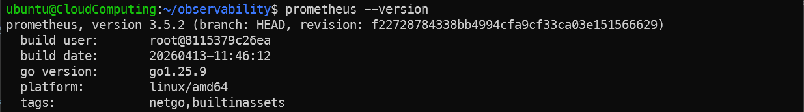

---

## 3. Prometheus 기본 설정

### prometheus.yml 작성

```bash
# 설정 파일 생성
sudo tee /etc/prometheus/prometheus.yml > /dev/null <<EOF
global:
  scrape_interval: 15s          # 전역 수집 주기
  evaluation_interval: 15s      # 알림 규칙 평가 주기

scrape_configs:
  - job_name: 'prometheus'      # 자기 자신 모니터링
    static_configs:
      - targets: ['localhost:9090']
EOF

# 작성 됐는지 확인
cat /etc/prometheus/prometheus.yml

# 소유권 적용
sudo chown prometheus:prometheus /etc/prometheus/prometheus.yml
```

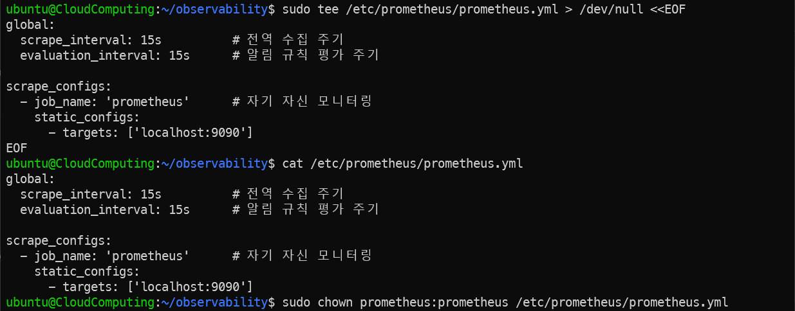

### systemd 서비스 등록

```bash
sudo tee /etc/systemd/system/prometheus.service > /dev/null <<EOF
[Unit]
Description=Prometheus
Wants=network-online.target
After=network-online.target

[Service]
User=prometheus
Group=prometheus
Type=simple
ExecStart=/usr/local/bin/prometheus \
  --config.file=/etc/prometheus/prometheus.yml \
  --storage.tsdb.path=/var/lib/prometheus/ \
  --web.listen-address=0.0.0.0:9090 \
  --web.enable-lifecycle

[Install]
WantedBy=multi-user.target
EOF
```

### 서비스 시작

```bash
# systemd 데몬 재로드
sudo systemctl daemon-reload

# Prometheus 시작 및 부팅 시 자동 시작 설정
sudo systemctl start prometheus
sudo systemctl enable prometheus

# 상태 확인
sudo systemctl status prometheus
```

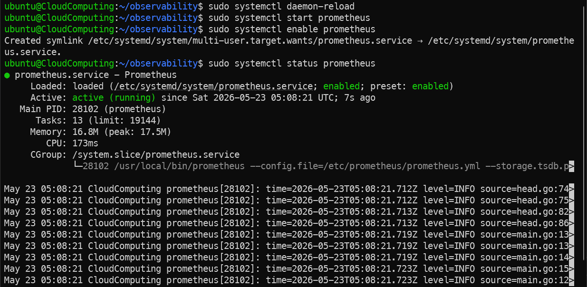

### 웹 UI 접속 확인

브라우저에서 `http://<호스트 IP>:9090` 접속

상단 메뉴 `Status > Targets` 에서 `prometheus` 타겟이 `UP` 상태인지 확인

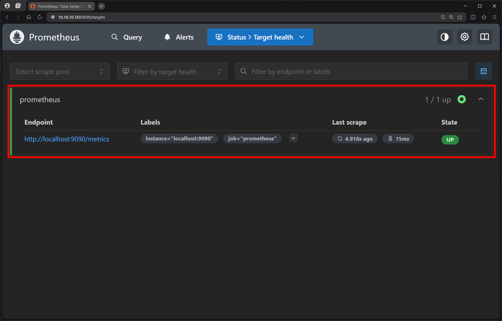

### 참고

- `--web.enable-lifecycle` 옵션은 `curl -X POST http://localhost:9090/-/reload` 로 무중단 설정 재로드를 가능하게 함
- TSDB 저장 경로(`/var/lib/prometheus`)는 시계열 데이터가 누적되는 위치이며 디스크 용량 관리 대상
- 기본 보존 기간은 15일이며 `--storage.tsdb.retention.time=30d` 옵션으로 변경 가능
- 본 실습은 **3.5 LTS(Long-Term Support)** 계열을 사용함 — LTS 는 약 1년간 보안·버그픽스를 받아 수업·운영 환경에 적합함 (일반 마이너 릴리즈는 6주 주기로 패치가 종료됨)
- Prometheus 3.x 는 새로운 웹 UI 와 UTF-8 메트릭 이름을 기본 지원하며, scrape 대상의 `Content-Type` 헤더 검증이 v2 보다 엄격해짐 (표준 Exporter 는 올바른 헤더를 보내므로 본 실습에는 영향 없음)

---

## 4. Node Exporter 설치

`Node Exporter`는 호스트의 CPU, Memory, Disk, Network 등 OS 및 하드웨어 메트릭을 수집하여 Prometheus 가 읽을 수 있는 포맷으로 노출하는 Exporter

### 전용 사용자 및 바이너리 설치

```bash
# 시스템 사용자 생성
sudo useradd --no-create-home --shell /bin/false node_exporter

# 바이너리 다운로드
cd ~/observability
wget https://github.com/prometheus/node_exporter/releases/download/v1.11.1/node_exporter-1.11.1.linux-amd64.tar.gz

# 압축 해제
tar xvf node_exporter-1.11.1.linux-amd64.tar.gz

# 바이너리를 /usr/local/bin 으로 이동
sudo cp node_exporter-1.11.1.linux-amd64/node_exporter /usr/local/bin/

# 소유권 변경
sudo chown node_exporter:node_exporter /usr/local/bin/node_exporter
```

### systemd 서비스 등록

```bash
sudo tee /etc/systemd/system/node_exporter.service > /dev/null <<EOF
[Unit]
Description=Node Exporter
Wants=network-online.target
After=network-online.target

[Service]
User=node_exporter
Group=node_exporter
Type=simple
ExecStart=/usr/local/bin/node_exporter --web.listen-address=:9100

[Install]
WantedBy=multi-user.target
EOF

# 데몬 재로드
sudo systemctl daemon-reload

# 서비스 시작 및 자동 시작 설정
sudo systemctl start node_exporter
sudo systemctl enable node_exporter

# 상태 확인
sudo systemctl status node_exporter
```

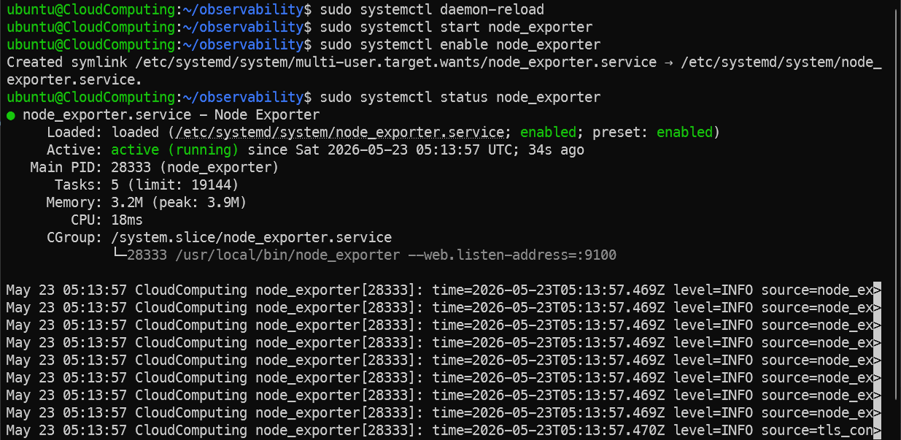

### 메트릭 노출 확인

```bash
# /metrics 엔드포인트 직접 호출 (Pull 방식의 실체 확인)
curl -s http://localhost:9100/metrics | grep '^node_' | head -30
```

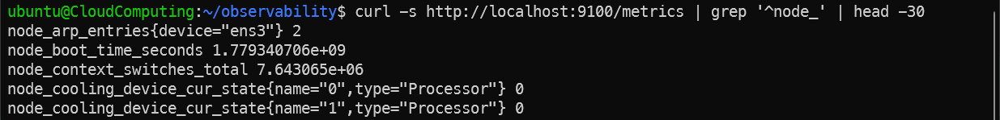

### 참고

- 출력되는 `# HELP`, `# TYPE` 주석은 Prometheus 표준 노출 포맷의 메타데이터임 (이론 슬라이드 39 참고)
- `node_cpu_seconds_total` 과 같이 `_total` 접미사가 붙은 메트릭은 Counter 타입임
- `node_memory_MemAvailable_bytes` 와 같이 현재 상태를 나타내는 메트릭은 Gauge 타입임

---

## 5. Prometheus 와 Node Exporter 연동

### 수집 대상 추가

```bash
# prometheus.yml 수정
sudo tee /etc/prometheus/prometheus.yml > /dev/null <<EOF
global:
  scrape_interval: 15s
  evaluation_interval: 15s

scrape_configs:
  - job_name: 'prometheus'
    static_configs:
      - targets: ['localhost:9090']

  - job_name: 'node'                              # Node Exporter Job 추가
    static_configs:
      - targets: ['localhost:9100']
        labels:
          instance: 'lab-server'                  # 사용자 정의 레이블 부여(자유롭게 수정 가능)
EOF

# 작성 됐는지 확인
cat /etc/prometheus/prometheus.yml
```

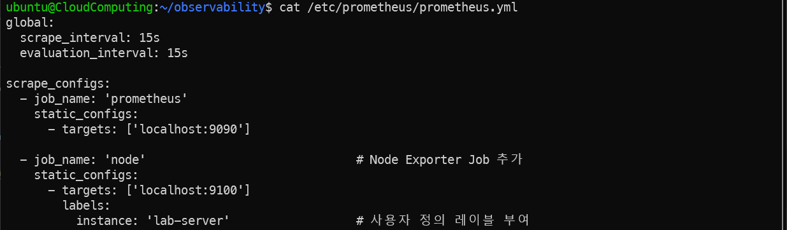

### 무중단 설정 재로드

```bash
# 서비스 재시작 없이 설정 반영
curl -X POST http://localhost:9090/-/reload
```

### Targets 확인

브라우저에서 `http://<호스트 IP>:9090/targets` 접속

`node` Job 하위에 `lab-server` 인스턴스가 `UP` 상태인지 확인

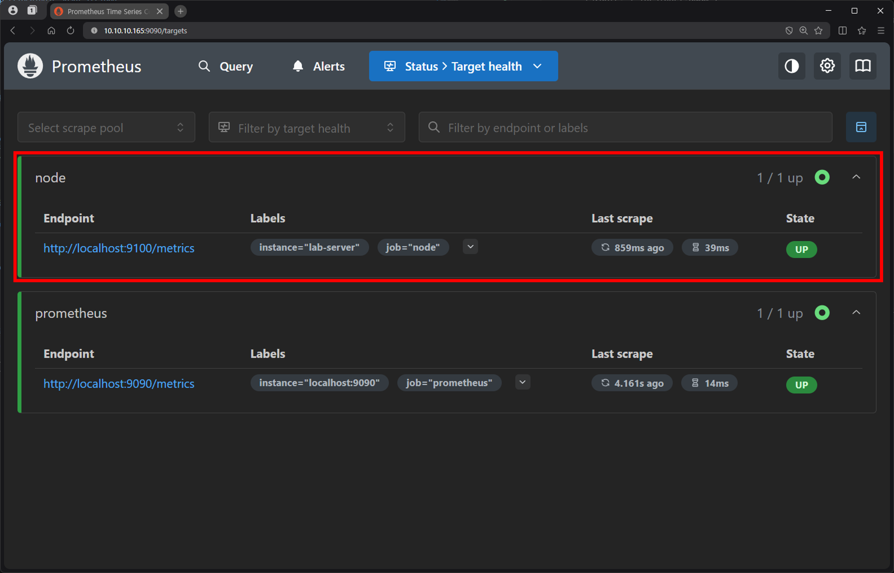

### 참고

- 레이블(`instance`, `job` 등)은 동일한 메트릭 이름을 가진 여러 시계열을 구분하는 핵심 식별자임
- PromQL 의 모든 필터링과 그룹화는 레이블 기반으로 동작함
- 동적 환경에서는 `static_configs` 대신 `kubernetes_sd_configs`, `consul_sd_configs` 등의 서비스 디스커버리를 사용함

---

## 6. PromQL 기초 실습

`PromQL(Prometheus Query Language)` 은 시계열 데이터를 선택하고 집계하기 위한 함수형 쿼리 언어

Prometheus UI 의 `Graph` 탭에서 다음 쿼리들을 차례로 실행해보고 결과 확인(별도로 스크린샷은 제공하지 않음)

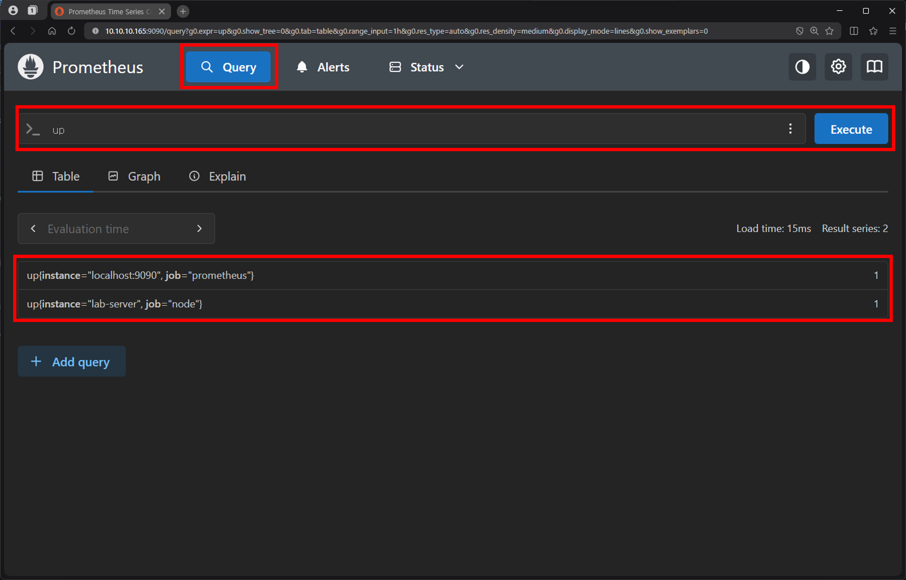

### Instant Vector 와 Range Vector

```promql
# Instant Vector: 현재 시점의 단일 값 집합
up

# Range Vector: 최근 5분간의 값 집합 (시계열 구간)
node_cpu_seconds_total[5m]
```

### Counter 메트릭과 rate() 함수

```promql
# 누적 카운터 자체를 보면 단조 증가 그래프만 나옴
node_cpu_seconds_total{mode="user"}

# rate() 로 초당 증가율을 계산해야 의미 있는 값이 나옴
rate(node_cpu_seconds_total{mode="user"}[5m])
```

### 집계 연산 (Aggregation)

```promql
# CPU mode 별로 합산하여 전체 CPU 사용 분포 확인
sum by (mode) (rate(node_cpu_seconds_total[5m]))

# CPU 사용률(%) 계산 - idle 시간의 비율을 100에서 빼는 방식
100 - (avg by (instance) (rate(node_cpu_seconds_total{mode="idle"}[5m])) * 100)
```

### 시스템 리소스 쿼리 예시

```promql
# 가용 메모리 비율(%)
node_memory_MemAvailable_bytes / node_memory_MemTotal_bytes * 100

# 디스크 사용량(%) - 루트 파일시스템 기준
100 - (node_filesystem_avail_bytes{mountpoint="/"} / node_filesystem_size_bytes{mountpoint="/"} * 100)

# 네트워크 수신 트래픽(bytes/sec)
rate(node_network_receive_bytes_total{device!="lo"}[5m])
```

### 부하 생성을 통한 그래프 변화 관찰

별도 터미널에서 CPU 부하 발생 후, Prometheus Graph 탭에서 CPU 사용률 쿼리가 변하는 것을 확인

```bash
# 4개 코어에 60초간 부하 생성
stress-ng --cpu 4 --timeout 60s
```

### 참고

- `rate()` 는 평균 증가율(범위 내 첫/끝 데이터 포인트 기반)
- `irate()` 는 가장 최근 두 데이터 포인트만으로 계산한 순간 증가율 (변동성 크지만 즉시성 높음)
- Counter 가 재시작되어 값이 초기화되더라도 `rate()` 는 이를 자동으로 보정함
- `histogram_quantile()` 같은 분포 함수는 Histogram 타입 메트릭에만 적용 가능

---

## 7. Grafana 설치

`Grafana` 는 시계열 데이터 및 로그를 시각화하는 오픈소스 대시보드 도구

### 공식 APT 저장소 등록

```bash
# GPG 키 추가
sudo mkdir -p /etc/apt/keyrings/
wget -q -O - https://apt.grafana.com/gpg.key | gpg --dearmor | sudo tee /etc/apt/keyrings/grafana.gpg > /dev/null

# 저장소 등록
echo "deb [signed-by=/etc/apt/keyrings/grafana.gpg] https://apt.grafana.com stable main" | sudo tee /etc/apt/sources.list.d/grafana.list
```

### 설치 및 시작

```bash
# 패키지 인덱스 갱신 후 설치
sudo apt update
sudo apt install -y grafana

# 설치 확인
grafana -v

# 서비스 시작
sudo systemctl daemon-reload
sudo systemctl start grafana-server
sudo systemctl enable grafana-server

# 상태 확인
sudo systemctl status grafana-server
```

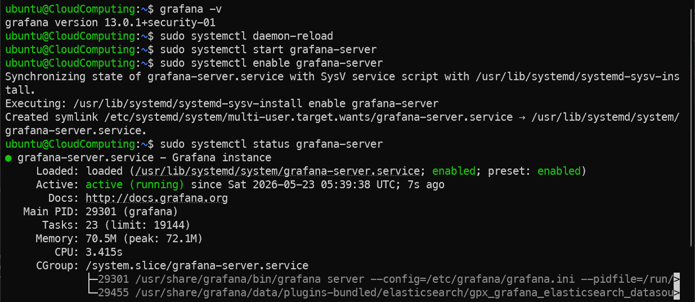

### 웹 UI 접속

브라우저에서 `http://<호스트 IP>:3000` 접속

초기 로그인 정보:
- 사용자명: `admin`
- 비밀번호: `admin` (최초 로그인 시 변경 요구됨)

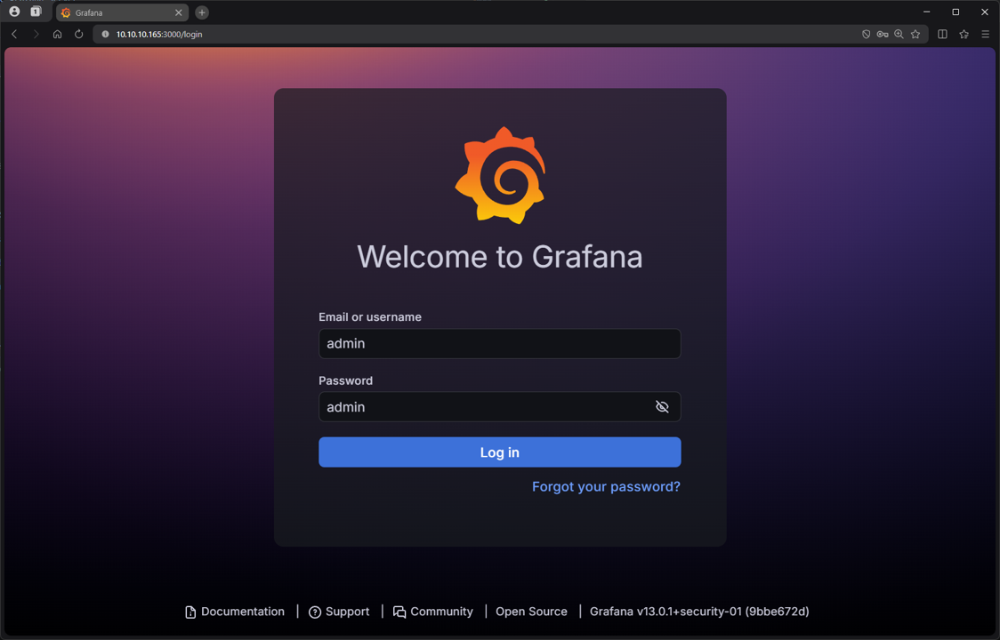

---

## 8. Grafana 데이터소스 및 대시보드 구성

### Prometheus 데이터소스 연결

1. 좌측 메뉴 `Connections > Data sources` 진입
2. `Add new data source` 클릭 후 `Prometheus` 선택
3. `Connection > Prometheus server URL` 에 `http://localhost:9090` 입력
4. 하단 `Save & test` 클릭하여 연결 확인

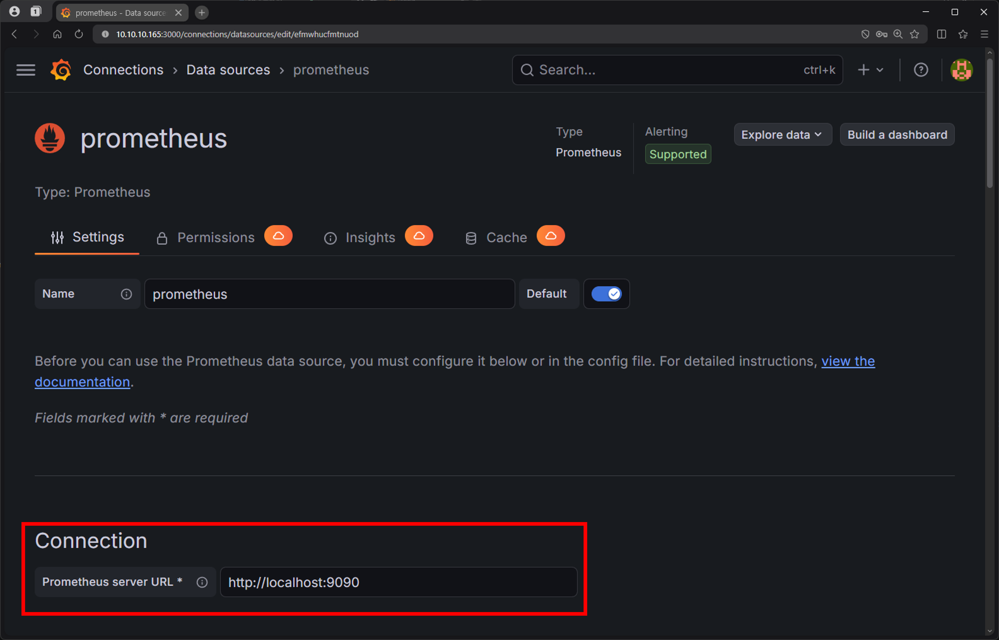

### 새 대시보드 생성

1. 좌측 메뉴 `Dashboards > New > New dashboard` 클릭
2. `Add new element` 클릭 후 `Panel` 선택 
3. 생성된 `Panel` 에서 `Configure visulaization` 진입
4. `Data source` 에서 `Prometheus` 선택
5. 아래에서 `Builder` 대신 `Code` 선택 후 아래의 쿼리 입력
6. `Run queries` 클릭하여 결과 확인 후 우측 상단 `Save` 클릭하여 패널 저장 (시각화 타입은 우측 상단 `Change` 버튼으로 변경 가능하며, 각 패널의 권장 타입은 아래 참조)
7. 동일한 방식으로 총 4개의 패널을 생성하여 CPU, Memory, Disk, Network 메트릭 시각화 (아래 쿼리 참조)

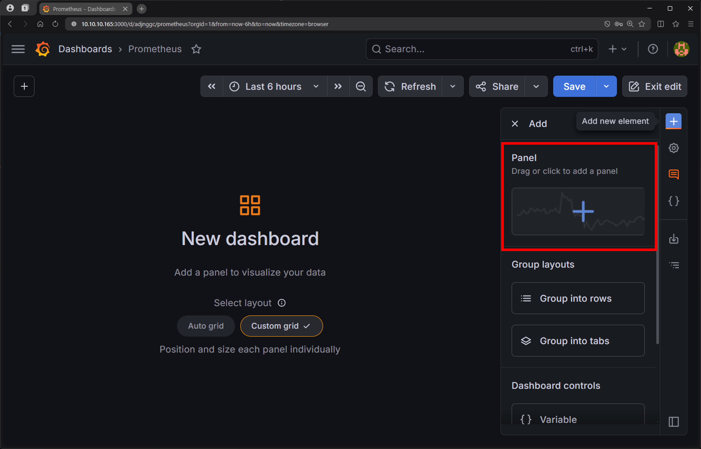
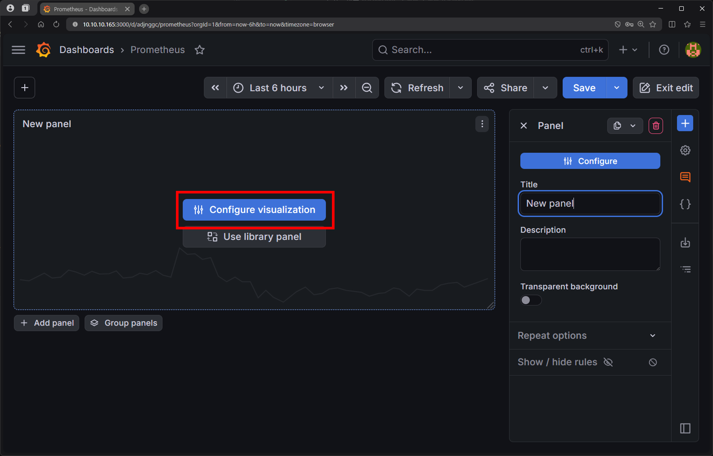
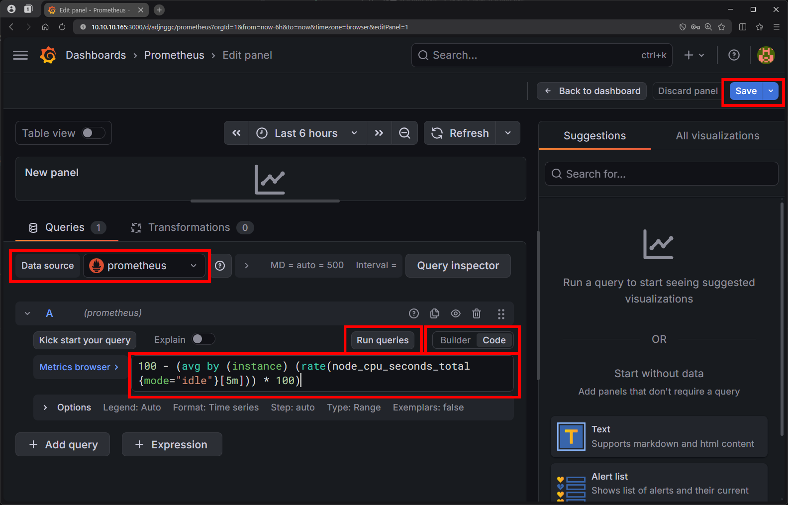
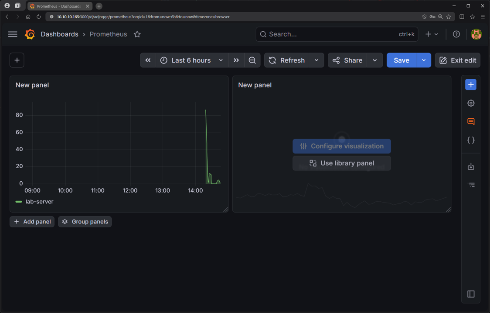

### 패널 1: CPU 사용률 (Time series)

쿼리:
```promql
100 - (avg by (instance) (rate(node_cpu_seconds_total{mode="idle"}[5m])) * 100)
```

우측 패널 옵션:
- `Title`: CPU Usage (%)
- `Standard options > Unit`: Percent (0-100)
- `Visualizations`: Time series

### 패널 2: 메모리 사용량 (Gauge)

쿼리:
```promql
100 - (node_memory_MemAvailable_bytes / node_memory_MemTotal_bytes * 100)
```

패널 옵션:
- `Title`: Memory Usage (%)
- `Visualizations`: Gauge
- `Standard options > Unit`: Percent (0-100)
- `Thresholds`: 70 (orange), 90 (red)

### 패널 3: 디스크 사용량 (Stat)

쿼리:
```promql
100 - (node_filesystem_avail_bytes{mountpoint="/"} / node_filesystem_size_bytes{mountpoint="/"} * 100)
```

패널 옵션:
- `Title`: Disk Usage (%)
- `Visualizations`: Stat

### 패널 4: 네트워크 트래픽 (Time series)

쿼리:
```promql
# Query A: 수신 트래픽
rate(node_network_receive_bytes_total{device!="lo"}[5m])

# Query B: 송신 트래픽
rate(node_network_transmit_bytes_total{device!="lo"}[5m])
```

패널 옵션:
- `Title`: Network Traffic
- `Standard options > Unit`: bytes/sec

### 대시보드 저장

우측 상단 `Save dashboard` 아이콘 클릭 후 이름 입력 (예: `Node Overview`)

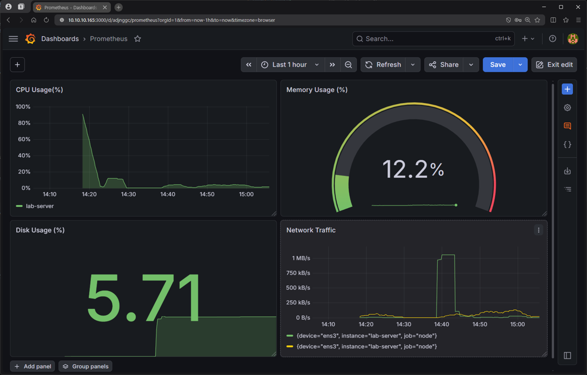

### 참고

- 각 패널 우상단 메뉴에서 `Inspect > JSON` 을 통해 패널 정의를 JSON 으로 확인 가능
- 대시보드 전체는 `Share > Export` 에서 JSON 으로 export 하여 버전 관리 가능 (이론 슬라이드 37 참고)
- 동일한 JSON 을 다른 Grafana 인스턴스에 import 하면 동일 대시보드 재현 가능

---

## 9. Grafana 변수 (Templating)

대시보드에 변수를 추가하여 동적으로 필터링되는 대시보드 구성

### 변수 추가

1. 대시보드 우상단 `Edit` 진입 후 `Settings (또는 Dashboard options)` > `Variables` 로 이동
2. `Add variable` 클릭 후 `Variable type` 을 `Query` 로 선택

최신 Grafana 는 변수 쿼리를 항목별 입력(Builder) 방식으로 구성함. 직접 `label_values(...)` 함수를 타이핑하지 않고, `Query type` 을 `Label values` 로 두고 각 칸을 채우면 Grafana 가 쿼리를 자동 조립함

### Job 변수 생성

`Query options > Open variable editor` 에서 다음과 같이 설정:

| 항목 | 값 |
| --- | --- |
| Name | `job` |
| Target data source | `prometheus` |
| Query type | `Label values` |
| Metric | `up` |
| Label | `job` |
| Label filters | (없음 - 비워둠) |
| Refresh | On dashboard load |

`Preview` 클릭 시 등록된 job 목록(예: `node`, `prometheus`)이 표시되면 정상

job 변수는 전체 job 목록을 가져오는 것이므로 **Label filters 가 없어야 함** (필터가 있으면 오류 발생)

### Instance 변수 생성 (Job 에 의존)

다시 `Add variable` 후 동일하게 `Query` 타입으로 설정:

| 항목 | 값 |
| --- | --- |
| Name | `instance` |
| Target data source | `prometheus` |
| Query type | `Label values` |
| Metric | `up` |
| Label | `instance` |
| Label filters | `job` `=` `$job` |
| Include All option | 활성화 |
| Refresh | On dashboard load |

`Label filters` 는 세 칸으로 나뉘며 각각 `job` / `=` / `$job` 을 지정함

instance 변수는 job 변수와 달리 **Label filters 가 반드시 있어야** 선택한 job 에 속한 instance 만 걸러짐

`Preview` 에 아무것도 안 나오면 대시보드 상단 `job` 드롭다운을 실제 값(예: `node`)으로 선택한 뒤 다시 확인


### 패널 쿼리에 변수 적용

job/instance 드롭다운 선택이 모든 패널에 일관되게 반영되도록, 앞서 만든 4개 패널의 쿼리에 `{job="$job", instance="$instance"}` 필터를 추가함

**CPU 패널:**

```promql
100 - (avg by (instance) (rate(node_cpu_seconds_total{job="$job",instance="$instance",mode="idle"}[5m])) * 100)
```

**메모리 패널:**

```promql
100 - (node_memory_MemAvailable_bytes{job="$job",instance="$instance"} / node_memory_MemTotal_bytes{job="$job",instance="$instance"} * 100)
```

**디스크 패널:**

```promql
100 - (node_filesystem_avail_bytes{job="$job",instance="$instance",mountpoint="/"} / node_filesystem_size_bytes{job="$job",instance="$instance",mountpoint="/"} * 100)
```

**네트워크 패널 (쿼리 2개):**

```promql
rate(node_network_receive_bytes_total{job="$job",instance="$instance",device!="lo"}[5m])
rate(node_network_transmit_bytes_total{job="$job",instance="$instance",device!="lo"}[5m])
```

대시보드 상단에 `job`, `instance` 드롭다운이 생기며 선택값에 따라 모든 패널이 일관되게 자동 필터링됨

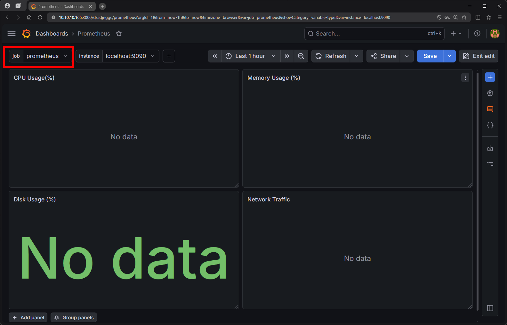
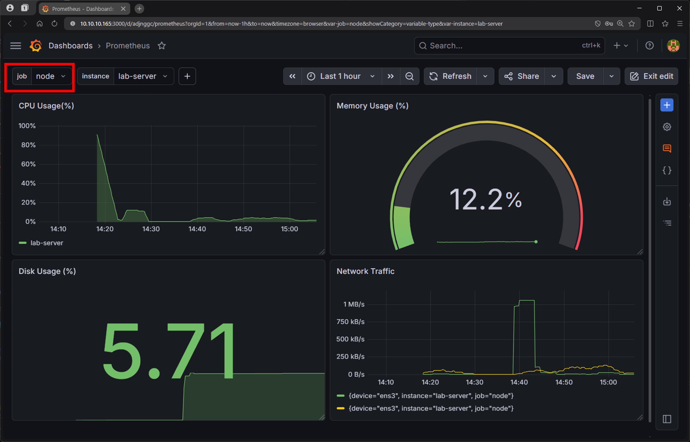

### 참고

- **변수 간 의존성(Chained Variables)**: 상위 변수 선택에 따라 하위 변수의 옵션이 자동 갱신됨. instance 변수가 job 선택값에 따라 걸러지는 것이 그 예시
- **변수 참조 형식**: `$variable_name`, `${variable_name}`, `[[variable_name]]` 모두 사용 가능
- **Include All option**: 활성화 시 `.*` regex 가 자동 적용되어 전체 데이터 조회 가능
- **No data 발생 시**: 패널이 모두 Node Exporter 메트릭이므로 `job` 드롭다운을 `node` 로 선택해야 표시됨. `prometheus` 선택 시 `No data` 가 뜨는 것은 변수 필터링이 정상 동작한다는 의미
- **Builder vs Code**: 최신 Grafana 의 변수 쿼리는 Builder(항목별 입력) 방식이 기본이며, `label_values(job)` 같은 함수를 직접 입력하려면 Code 방식으로 전환해야 함

---

## 10. Alertmanager 설치

`Alertmanager` 는 Prometheus 가 발생시킨 알림을 받아 중복 제거, 그룹화, 라우팅, 채널 전송을 담당하는 별도 컴포넌트

### 전용 사용자 및 디렉토리 생성

```bash
sudo useradd --no-create-home --shell /bin/false alertmanager
sudo mkdir -p /etc/alertmanager /var/lib/alertmanager
```

### 바이너리 설치

```bash
# Alertmanager 릴리즈 다운로드
cd ~/observability
wget https://github.com/prometheus/alertmanager/releases/download/v0.32.1/alertmanager-0.32.1.linux-amd64.tar.gz

# 압축 해제 및 바이너리 이동
tar xvf alertmanager-0.32.1.linux-amd64.tar.gz
sudo cp alertmanager-0.32.1.linux-amd64/alertmanager /usr/local/bin/
sudo cp alertmanager-0.32.1.linux-amd64/amtool /usr/local/bin/

# 소유권 변경
sudo chown alertmanager:alertmanager /usr/local/bin/alertmanager /usr/local/bin/amtool
sudo chown -R alertmanager:alertmanager /etc/alertmanager /var/lib/alertmanager
```

### webhook.site 에서 테스트용 URL 발급

테스트용 알림 채널로 [webhook.site](https://webhook.site) 를 사용하면 별도 Slack/이메일 설정 없이 알림 전송을 확인 가능

1. 브라우저에서 `https://webhook.site` 접속
2. 접속 시 자동으로 본인 전용 고유 URL 이 생성됨 (예: `https://webhook.site/12ab34cd-...`)
3. 화면 상단의 `Your unique URL` 값을 복사해 둠
4. 이 페이지를 열어둔 채로 두면, 이후 Alertmanager 가 보낸 요청이 실시간으로 표시됨

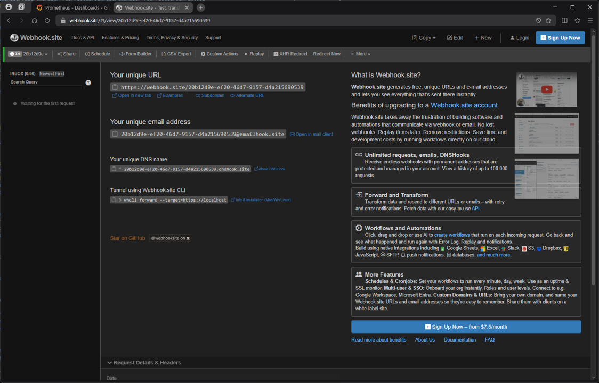

### Alertmanager 설정 파일 작성

위에서 복사한 URL 을 아래 설정의 `url` 항목에 붙여넣음

```bash
# 설정 파일 작성
sudo tee /etc/alertmanager/alertmanager.yml > /dev/null <<EOF
global:
  resolve_timeout: 5m

route:
  group_by: ['alertname']         # 동일한 alertname 의 알림을 그룹화
  group_wait: 10s                 # 그룹의 첫 알림 대기 시간
  group_interval: 10s             # 동일 그룹 내 추가 알림 대기 시간
  repeat_interval: 1h             # 동일 알림 재전송 주기
  receiver: 'webhook-receiver'

receivers:
  - name: 'webhook-receiver'
    webhook_configs:
      - url: '[발급받은-URL]'      # 위에서 복사한 URL로 교체
        send_resolved: true       # 알림 해제 시에도 전송
EOF

# 소유권 적용
sudo chown alertmanager:alertmanager /etc/alertmanager/alertmanager.yml
```

### systemd 서비스 등록 및 시작

```bash
# 서비스 파일 작성
sudo tee /etc/systemd/system/alertmanager.service > /dev/null <<EOF
[Unit]
Description=Alertmanager
Wants=network-online.target
After=network-online.target

[Service]
User=alertmanager
Group=alertmanager
Type=simple
ExecStart=/usr/local/bin/alertmanager \
  --config.file=/etc/alertmanager/alertmanager.yml \
  --storage.path=/var/lib/alertmanager \
  --web.listen-address=:9093

[Install]
WantedBy=multi-user.target
EOF

# 데몬 재로드 및 서비스 시작
sudo systemctl daemon-reload
sudo systemctl start alertmanager
sudo systemctl enable alertmanager

# 상태 확인
sudo systemctl status alertmanager
```

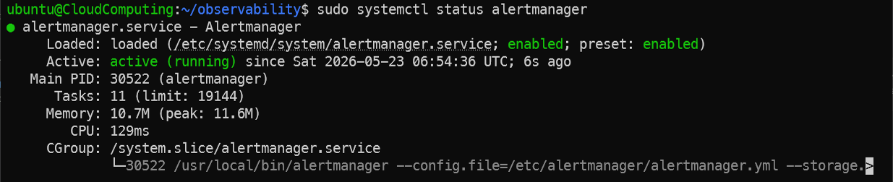

### 웹 UI 접속

`http://<호스트 IP>:9093` 에서 Alertmanager UI 확인

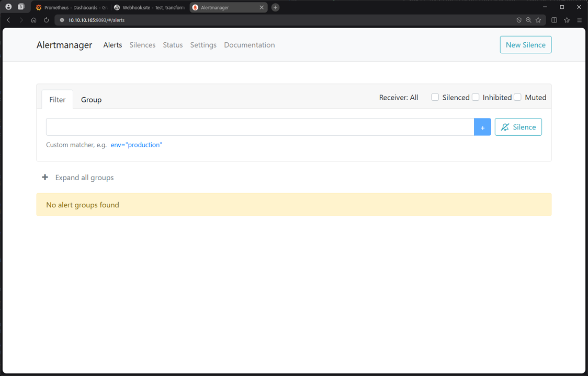

---

## 11. Alert Rule 작성 및 Prometheus 연동

### Prometheus 가 Alertmanager 를 인식하도록 설정 추가

```bash
sudo tee /etc/prometheus/prometheus.yml > /dev/null <<EOF
global:
  scrape_interval: 15s
  evaluation_interval: 15s

alerting:
  alertmanagers:
    - static_configs:
        - targets: ['localhost:9093']

rule_files:
  - "/etc/prometheus/rules/*.yml"

scrape_configs:
  - job_name: 'prometheus'
    static_configs:
      - targets: ['localhost:9090']

  - job_name: 'node'
    static_configs:
      - targets: ['localhost:9100']
        labels:
          instance: 'lab-server'
EOF
```

### Alert Rule 파일 작성

```bash
# 규칙 디렉토리 생성
sudo mkdir -p /etc/prometheus/rules

# CPU 및 메모리 관련 알림 규칙 (수업 시연용 - 임계값/지속시간을 낮춰 빠른 발동 유도)
sudo tee /etc/prometheus/rules/node-alerts.yml > /dev/null <<EOF
groups:
  - name: node-alerts
    interval: 15s
    rules:
      - alert: HighCPUUsage
        # 시연용: [1m] 평균에 임계값 50%, for 30s 로 빠르게 발동
        # (운영 환경에서는 [2m] 평균, > 80, for 5m 등으로 상향 권장)
        expr: 100 - (avg by (instance) (rate(node_cpu_seconds_total{mode="idle"}[1m])) * 100) > 50
        for: 30s
        labels:
          severity: warning
        annotations:
          summary: "High CPU usage on {{ \$labels.instance }}"
          description: "CPU usage is {{ \$value | printf \"%.2f\" }}% on {{ \$labels.instance }}"

      - alert: HighMemoryUsage
        expr: (1 - node_memory_MemAvailable_bytes / node_memory_MemTotal_bytes) * 100 > 85
        for: 1m
        labels:
          severity: warning
        annotations:
          summary: "High memory usage on {{ \$labels.instance }}"
          description: "Memory usage is {{ \$value | printf \"%.2f\" }}%"

      - alert: InstanceDown
        expr: up == 0
        for: 30s
        labels:
          severity: critical
        annotations:
          summary: "Instance {{ \$labels.instance }} is down"
EOF

sudo chown -R prometheus:prometheus /etc/prometheus/rules
```

### 규칙 문법 검증

```bash
# promtool 로 사전 검증
promtool check rules /etc/prometheus/rules/node-alerts.yml
```

### 설정 재로드 및 규칙 확인

```bash
# Prometheus 설정 재로드
curl -X POST http://localhost:9090/-/reload
```

Prometheus UI `Alerts` 탭에서 정의된 규칙 3개가 표시되는지 확인

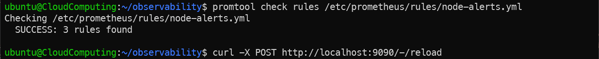

### 알림 발생 테스트

CPU 부하를 80% 이상으로 유지하여 `HighCPUUsage` 알림 트리거

```bash
# 모든 코어*2에 300초간 부하 생성
stress-ng --cpu $(($(nproc) * 2)) --timeout 300s
```

진행 과정:
1. Prometheus UI `Alerts` 탭에서 `PENDING` (조건 만족, `for` 대기 중) 상태 확인
2. 1분 경과 후 `FIRING` 상태로 전환되는지 확인
3. Alertmanager UI (`:9093`) 에서 활성 알림 수신 확인
4. webhook.site 페이지에서 webhook 호출 내역 확인

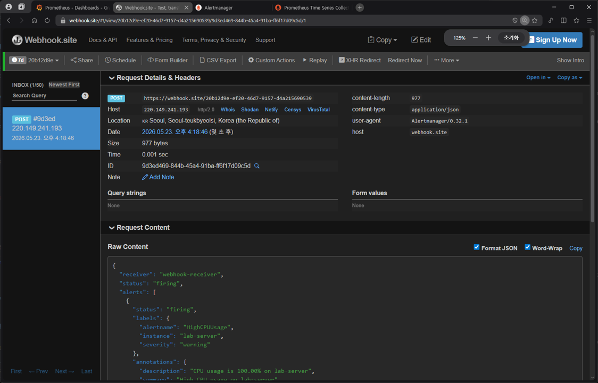

### 참고

- `for: 1m` 은 조건이 1분 이상 지속될 때만 알림을 전송하여 일시적 스파이크로 인한 오탐을 방지함
- Alert 의 라이프사이클은 `Inactive → Pending → Firing` 으로 전이됨
- `{{ $labels.instance }}` 와 같은 Go 템플릿 문법으로 알림 메시지에 동적 정보 삽입 가능
- 운영 환경에서는 webhook 대신 Slack, PagerDuty, 이메일 등 실제 채널을 사용함

---

## 12. Custom Exporter 개발

표준 Exporter 가 제공하지 않는 애플리케이션 비즈니스 메트릭을 노출하기 위해 Python 으로 Custom Exporter 직접 작성

### Python 가상환경 및 라이브러리 설치

```bash
cd ~/observability
python3 -m venv exporter-venv
source exporter-venv/bin/activate

# Prometheus Python 클라이언트 라이브러리
pip install prometheus_client
```

### Custom Exporter 코드 작성

```python
cat > ~/observability/custom_exporter.py <<'EOF'
from prometheus_client import Counter, Gauge, Histogram, start_http_server
import random
import time

# Counter: 누적 증가만 가능한 메트릭 (요청 수, 에러 수 등)
REQUESTS = Counter(
    'myapp_requests_total',
    'Total HTTP requests processed',
    ['endpoint', 'status']         # 레이블 정의
)

# Gauge: 증감 가능한 현재 상태 메트릭 (활성 사용자, 큐 크기 등)
ACTIVE_USERS = Gauge(
    'myapp_active_users',
    'Currently active users'
)

# Histogram: 값의 분포를 버킷 단위로 집계 (응답 시간 분포 등)
LATENCY = Histogram(
    'myapp_request_duration_seconds',
    'Request latency distribution',
    buckets=[0.1, 0.25, 0.5, 1.0, 2.5, 5.0]
)

if __name__ == '__main__':
    # 8000번 포트에서 /metrics 엔드포인트 노출
    start_http_server(8000)
    print("Custom exporter started on :8000")

    # 비즈니스 로직 시뮬레이션 - 가상의 요청을 지속 생성
    endpoints = ['/api/login', '/api/checkout', '/api/search']
    while True:
        endpoint = random.choice(endpoints)
        # 90% 성공, 10% 에러를 가정
        status = '200' if random.random() < 0.9 else '500'

        REQUESTS.labels(endpoint=endpoint, status=status).inc()
        ACTIVE_USERS.set(random.randint(10, 100))
        LATENCY.observe(random.expovariate(2))   # 평균 0.5초 응답시간 분포

        time.sleep(0.5)
EOF
```

### 직접 실행 및 메트릭 확인

```bash
# 가상환경 활성화 상태에서 실행
python3 ~/observability/custom_exporter.py
```

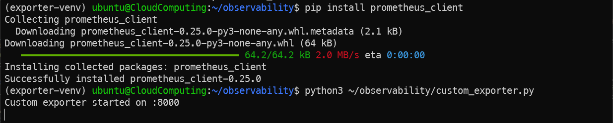

별도 터미널에서 메트릭 노출 확인:

```bash
curl http://localhost:8000/metrics | grep myapp
```

3종 메트릭(Counter, Gauge, Histogram)이 모두 노출되는 것 확인

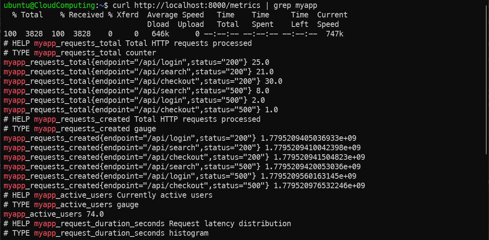

### systemd 서비스 등록

운영을 위해 서비스로 등록 (Ctrl+C 로 종료 후)

```bash
# 서비스 파일 작성
sudo tee /etc/systemd/system/custom-exporter.service > /dev/null <<EOF
[Unit]
Description=Custom Prometheus Exporter
After=network.target

[Service]
Type=simple
User=$USER
WorkingDirectory=$HOME/observability
ExecStart=$HOME/observability/exporter-venv/bin/python3 $HOME/observability/custom_exporter.py
Restart=on-failure

[Install]
WantedBy=multi-user.target
EOF

# 데몬 재로드 및 서비스 시작
sudo systemctl daemon-reload
sudo systemctl start custom-exporter
sudo systemctl enable custom-exporter
```

### Prometheus 수집 대상에 추가

```bash
# prometheus.yml 의 scrape_configs 에 추가
sudo sed -i '/- job_name: '\''node'\''/i\  - job_name: '\''custom-app'\''\n    static_configs:\n      - targets: ['\''localhost:8000'\'']\n' /etc/prometheus/prometheus.yml

# 설정 재로드
curl -X POST http://localhost:9090/-/reload
```

### PromQL 로 Custom 메트릭 조회

Prometheus UI 에서 다음 쿼리 실행:

```promql
# 엔드포인트별 초당 요청 수
sum by (endpoint) (rate(myapp_requests_total[1m]))

# 에러율(%) - 500 응답 비율
sum(rate(myapp_requests_total{status="500"}[1m])) / sum(rate(myapp_requests_total[1m])) * 100

# 응답 시간 P99 (Histogram 메트릭에 histogram_quantile 적용)
histogram_quantile(0.99, sum by (le) (rate(myapp_request_duration_seconds_bucket[1m])))

# 현재 활성 사용자 수
myapp_active_users
```

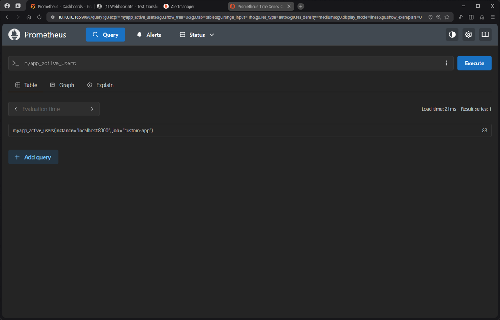

```bash
# python venv 종료
deactivate
```

### 참고

- Counter 는 단조 증가만 가능하므로 `_total` 접미사를 붙이는 것이 관례
- Gauge 는 `set()`, `inc()`, `dec()` 모두 호출 가능
- Histogram 은 내부적으로 `_bucket`, `_sum`, `_count` 3개의 시계열을 생성하며 `histogram_quantile()` 함수와 함께 사용함
- Summary 타입은 클라이언트 측에서 분위수를 계산하므로 정확하지만 집계가 불가능함

---

## 13. Elasticsearch 설치

`Elasticsearch` 는 JSON 기반의 분산형 RESTful 검색 엔진으로, ELK 스택의 저장소 역할 담당

### Elastic 공식 APT 저장소 등록

```bash
# GPG 키 추가
wget -qO - https://artifacts.elastic.co/GPG-KEY-elasticsearch | sudo gpg --dearmor -o /usr/share/keyrings/elasticsearch-keyring.gpg

# 저장소 등록 (8.x 버전)
echo "deb [signed-by=/usr/share/keyrings/elasticsearch-keyring.gpg] https://artifacts.elastic.co/packages/8.x/apt stable main" | sudo tee /etc/apt/sources.list.d/elastic-8.x.list
```

### 설치

```bash
sudo apt update
sudo apt install -y elasticsearch
```

뒤에서 보안 기능(`xpack.security`)을 비활성화하므로 설치 시 출력되는 초기 비밀번호는 사용하지 않음

### 메모리 설정 (실습용 축소)

기본값은 ES 가 시스템 메모리의 절반을 사용하려 하므로, 실습 환경에 맞게 축소

```bash
# ES 가 사용할 힙 메모리를 1GB 로 제한 (실습용 - 운영 환경에서는 시스템 메모리의 절반 이상 권장하지 않음)
sudo tee /etc/elasticsearch/jvm.options.d/heap.options > /dev/null <<EOF
-Xms1g
-Xmx1g
EOF
```

### 단일 노드 모드 설정

```bash
# elasticsearch.yml 주요 항목 수정
sudo sed -i 's/#cluster.name:.*/cluster.name: lab-cluster/' /etc/elasticsearch/elasticsearch.yml
sudo sed -i 's/#node.name:.*/node.name: node-1/' /etc/elasticsearch/elasticsearch.yml
sudo sed -i 's/#network.host:.*/network.host: 0.0.0.0/' /etc/elasticsearch/elasticsearch.yml

# 단일 노드 모드 설정
echo "discovery.type: single-node" | sudo tee -a /etc/elasticsearch/elasticsearch.yml

# 자동 생성된 initial_master_nodes 주석 처리 (node.name 변경으로 인한 이름 불일치 방지)
sudo sed -i 's/^cluster.initial_master_nodes:/#cluster.initial_master_nodes:/' /etc/elasticsearch/elasticsearch.yml

# 실습 편의를 위해 보안 기능 비활성화 (운영 환경에서는 활성화 필수)
sudo sed -i 's/xpack.security.enabled: true/xpack.security.enabled: false/' /etc/elasticsearch/elasticsearch.yml
sudo sed -i 's/xpack.security.enrollment.enabled: true/xpack.security.enrollment.enabled: false/' /etc/elasticsearch/elasticsearch.yml

# HTTP/Transport SSL 비활성화
sudo sed -i '/xpack.security.http.ssl:/,/^[^ ]/{s/enabled: true/enabled: false/}' /etc/elasticsearch/elasticsearch.yml
sudo sed -i '/xpack.security.transport.ssl:/,/^[^ ]/{s/enabled: true/enabled: false/}' /etc/elasticsearch/elasticsearch.yml
```

### 서비스 시작

```bash
sudo systemctl daemon-reload
sudo systemctl start elasticsearch
sudo systemctl enable elasticsearch

# 시작에 1~2분 소요됨
sudo systemctl status elasticsearch
```

### 동작 확인

```bash
# 클러스터 정보 조회
curl http://localhost:9200

# 클러스터 헬스 확인 (yellow 또는 green 이면 정상)
curl "http://localhost:9200/_cluster/health?pretty"
```

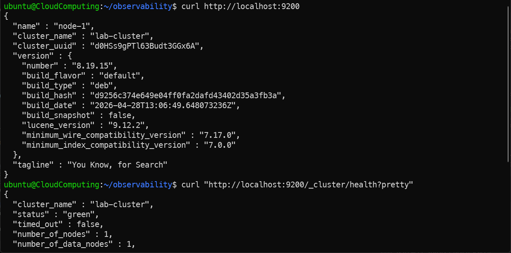

### 참고

- 운영 환경에서는 반드시 `xpack.security.enabled: true` 로 유지하고 TLS 와 인증을 활성화해야 함
- 단일 노드 클러스터는 인덱스 생성 전 `status: green`, 인덱스 생성 후 `status: yellow` 가 정상임 (복제 샤드를 할당할 추가 노드가 없기 때문이며 데이터 동작에는 문제 없음)
- ES 데이터는 `/var/lib/elasticsearch/` 에 저장되며 디스크 사용량 주의
- Elastic 8.x 저장소를 사용하므로 ES/Kibana/Logstash/Filebeat 가 동일 버전대로 자동 설치됨 (Elastic Stack 은 컴포넌트 간 버전 일치가 권장됨)

---

## 14. Kibana 설치 및 설정

`Kibana` 는 Elasticsearch 데이터를 검색, 시각화, 관리하는 웹 UI

### 설치

```bash
# Elasticsearch 저장소가 이미 등록되어 있으므로 바로 설치
sudo apt install -y kibana
```

### 설정

```bash
# Elasticsearch 연결 및 외부 접속 허용
sudo sed -i 's/#server.host:.*/server.host: "0.0.0.0"/' /etc/kibana/kibana.yml
sudo sed -i 's|#elasticsearch.hosts:.*|elasticsearch.hosts: ["http://localhost:9200"]|' /etc/kibana/kibana.yml
```

### 서비스 시작

```bash
# 대몬 재로드 및 서비스 시작
sudo systemctl daemon-reload
sudo systemctl start kibana
sudo systemctl enable kibana

# 시작에 1분 정도 소요됨
sudo systemctl status kibana
```

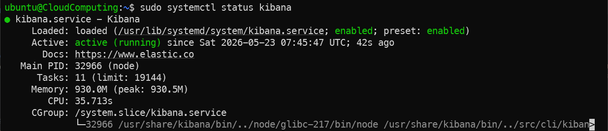

### 웹 UI 접속

브라우저에서 `http://<호스트 IP>:5601` 접속

`Explore on my own` 선택 후 메인 화면 진입

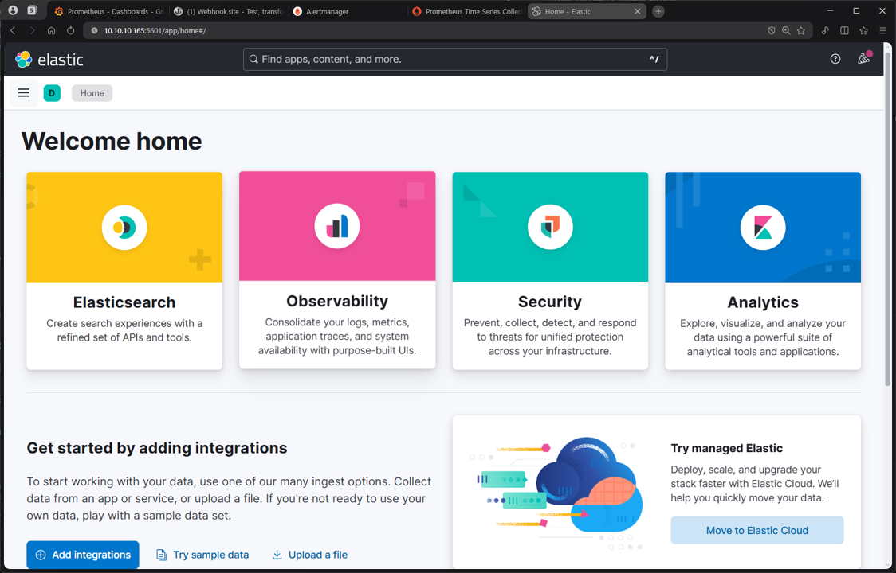

---

## 15. Logstash 설치 및 파이프라인 구성

`Logstash` 는 다양한 소스로부터 데이터를 수집하여 변환 후 저장소로 전송하는 ETL 도구

### 설치

```bash
sudo apt install -y logstash
```

### 파이프라인 설정 작성

Filebeat 로부터 입력을 받아, Grok 패턴으로 파싱하여 Elasticsearch 로 전송하는 파이프라인 구성

```bash
sudo tee /etc/logstash/conf.d/main.conf > /dev/null <<'EOF'
input {
  beats {
    port => 5044                                    # Filebeat 수신 포트
  }
}

filter {
  # Nginx access log 형식 파싱
  if [fields][log_type] == "nginx" {
    grok {
      match => { "message" => "%{COMBINEDAPACHELOG}" }
    }
    # 응답 시간을 숫자형으로 변환
    mutate {
      convert => { "response" => "integer" }
      convert => { "bytes" => "integer" }
    }
    # @timestamp 를 로그 내부 타임스탬프로 교체
    date {
      match => [ "timestamp", "dd/MMM/yyyy:HH:mm:ss Z" ]
    }
  }
}

output {
  elasticsearch {
    hosts => ["http://localhost:9200"]
    index => "lab-%{[fields][log_type]}-%{+YYYY.MM.dd}"   # logs- 프리픽스는 ES 내장 data stream 템플릿에 걸리므로 lab- 사용
    data_stream => "false"                                # 일반 인덱스로 강제 (data stream 색인 거부 방지)
  }

  stdout {
    codec => rubydebug
  }
}
EOF
```

### 설정 검증 및 시작

```bash
# 설정 문법 검증 (--path.settings 로 설정 디렉토리 지정 필요)
sudo -u logstash /usr/share/logstash/bin/logstash --path.settings /etc/logstash --config.test_and_exit -f /etc/logstash/conf.d/main.conf
# 위 명령어가 `Configuration OK` 를 출력하면 문법이 정상임

# 서비스 시작
sudo systemctl start logstash
sudo systemctl enable logstash

# 시작에 30초 정도 소요됨
sudo systemctl status logstash
```

### 동작 확인

```bash
# Logstash(java) 가 5044 포트에서 수신 대기 중인지 확인
sudo ss -tlnp | grep 5044
```

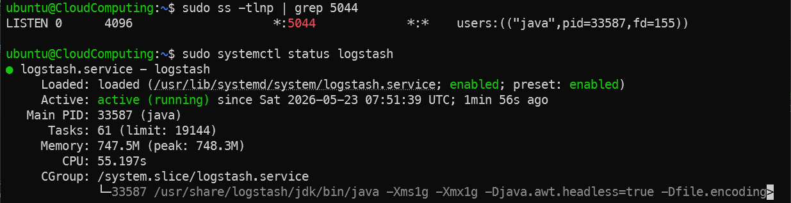

### 참고

- Grok 패턴은 정규표현식의 추상화된 형태로 `%{PATTERN:field_name}` 문법 사용
- 내장 패턴 목록은 [Logstash grok-patterns 저장소](https://github.com/logstash-plugins/logstash-patterns-core/tree/main/patterns) 에서 확인 가능
- `stdout { codec => rubydebug }` 는 개발 단계에서 파싱 결과를 직접 확인할 때 유용함
- 인덱스 명에 날짜를 포함하면 일자별로 분리 저장되어 보존 정책 관리가 용이함

---

## 16. Filebeat 설치 및 로그 수집

`Filebeat` 는 서버에 설치되어 로그 파일을 읽고 중앙으로 전송하는 경량 Shipper

### 설치

```bash
sudo apt install -y filebeat
```

### 테스트용 로그 소스 준비

실제 nginx 가 없어도 동작 확인이 가능하도록 샘플 access log 생성

```bash
sudo mkdir -p /var/log/nginx-sample

# 임의의 nginx access log 형식 데이터 생성
NOW=$(date '+%d/%b/%Y:%H:%M:%S %z')
sudo tee /var/log/nginx-sample/access.log > /dev/null <<EOF
192.168.1.10 - - [$NOW] "GET /api/login HTTP/1.1" 200 1024 "-" "Mozilla/5.0"
192.168.1.11 - - [$NOW] "POST /api/checkout HTTP/1.1" 500 512 "-" "Mozilla/5.0"
192.168.1.12 - - [$NOW] "GET /api/search?q=test HTTP/1.1" 200 2048 "-" "curl/7.81"
192.168.1.13 - - [$NOW] "GET /api/login HTTP/1.1" 401 256 "-" "Mozilla/5.0"
192.168.1.14 - - [$NOW] "POST /api/checkout HTTP/1.1" 200 768 "-" "Mozilla/5.0"
EOF
```

### Filebeat 설정

```bash
sudo tee /etc/filebeat/filebeat.yml > /dev/null <<'EOF'
filebeat.inputs:
  - type: filestream
    id: nginx-access
    enabled: true
    paths:
      - /var/log/nginx-sample/*.log
    fields:
      log_type: nginx

output.logstash:
  hosts: ["localhost:5044"]

logging.level: info
logging.to_files: true
logging.files:
  path: /var/log/filebeat
  name: filebeat
EOF
```

### 권한 설정 및 시작

```bash
# 서비스 시작
sudo systemctl start filebeat
sudo systemctl enable filebeat

sudo systemctl status filebeat
```

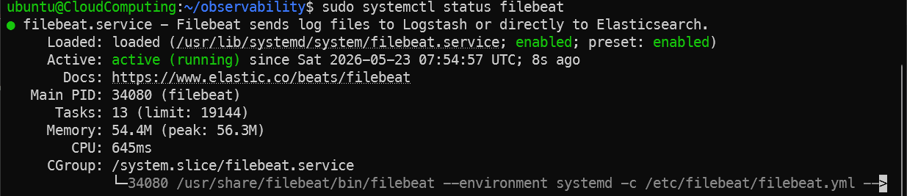

### Elasticsearch 에 인덱스 생성 확인

```bash
# 생성된 인덱스 목록 조회
curl http://localhost:9200/_cat/indices?v
```

`lab-nginx-*` 인덱스가 생성되어 있어야 함

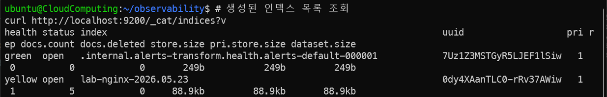

```bash
# nginx 인덱스의 문서 수 확인
curl "http://localhost:9200/lab-nginx-*/_count?pretty"

# 문서 내용 샘플 조회
curl "http://localhost:9200/lab-nginx-*/_search?pretty&size=2"
```

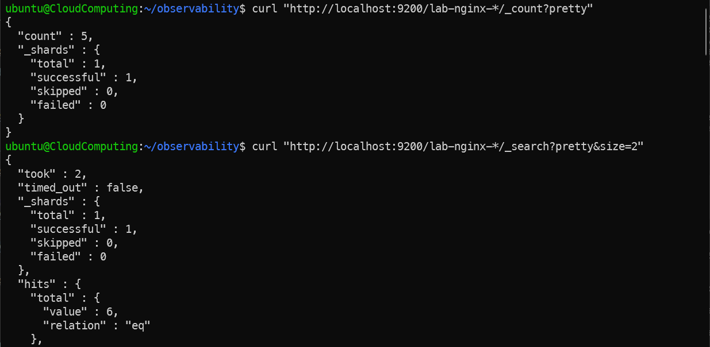

### 새 로그 추가하여 실시간 수집 확인

```bash
# 새 로그 라인 추가
NOW=$(date '+%d/%b/%Y:%H:%M:%S %z')
echo "192.168.1.99 - - [$NOW] \"GET /api/test HTTP/1.1\" 200 100 \"-\" \"test-agent\"" | sudo tee -a /var/log/nginx-sample/access.log


# 몇 초 대기 후 ES 에서 새 문서 확인
sleep 5
curl "http://localhost:9200/lab-nginx-*/_count?pretty"
```

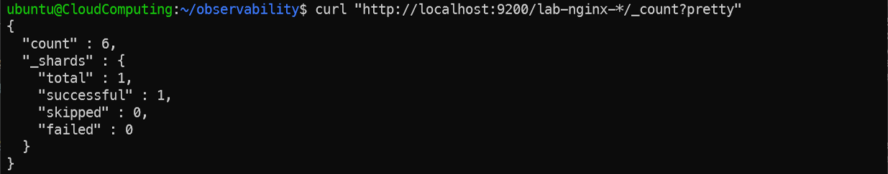

### 참고

- `filestream` 입력 타입은 Filebeat 7.x 이후 도입된 신형이며, 구형 `log` 타입을 대체함
- 파일 회전(rotation) 추적은 inode 기반으로 처리되며 상태는 `/var/lib/filebeat/registry/` 에 저장됨
- Filebeat → ES 직접 전송도 가능하나, 파싱이 필요하면 Logstash 경유가 일반적임

---

## 17. Kibana 에서 로그 검색 및 시각화

### Data View 생성

1. Kibana 좌측 메뉴 `Management > Stack Management` 진입
2. `Kibana > Data Views` 선택 후 `Create data view` 클릭
3. 입력값:
   - Name: `Nginx Logs`
   - Index pattern: `lab-nginx-*`
   - Timestamp field: `@timestamp`
4. `Save data view to Kibana` 클릭

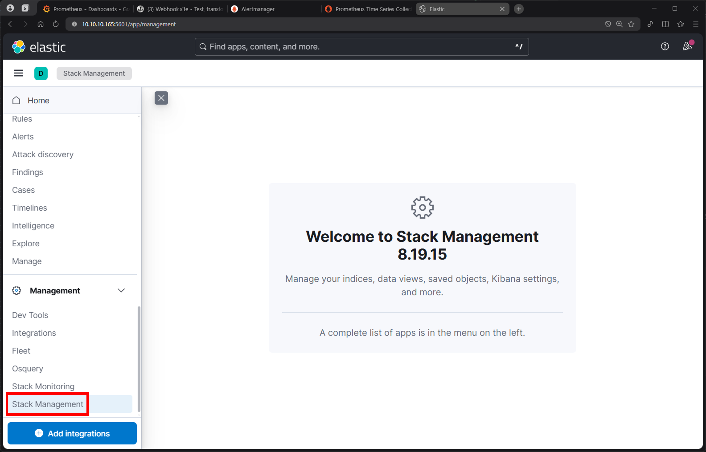
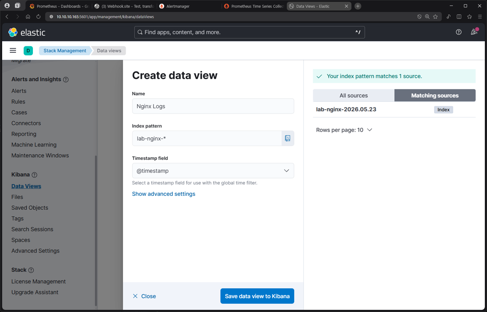

### Discover 로 로그 검색

1. 좌측 메뉴 `Analytics > Discover` 진입
2. 상단 Data view 드롭다운에서 `Nginx Logs` 선택
3. 우측 상단 시간 범위를 `Last 1 hour` 또는 `Last 24 hours` 로 설정

샘플 로그가 현재 시각으로 생성되므로 `Last 1 hour` 범위에서 바로 표시됨. 안 보이면 우측 상단 시간 범위를 넓히거나 새로고침

### KQL 쿼리 예시

검색창에 다음 쿼리들을 차례로 입력 (Logstash ECS v8 모드 기준 필드명):

```text
# 500 에러만 필터링
http.response.status_code : 500

# 특정 엔드포인트 + 에러
url.original : "/api/checkout" and http.response.status_code >= 400

# 클라이언트 IP 범위
source.address.keyword : 192.168.1.*

# 특정 클랑언트 IP
source.address.keyword : "192.168.1.13"

# AND/OR 조합
http.response.status_code : 500 or http.response.status_code : 401
```

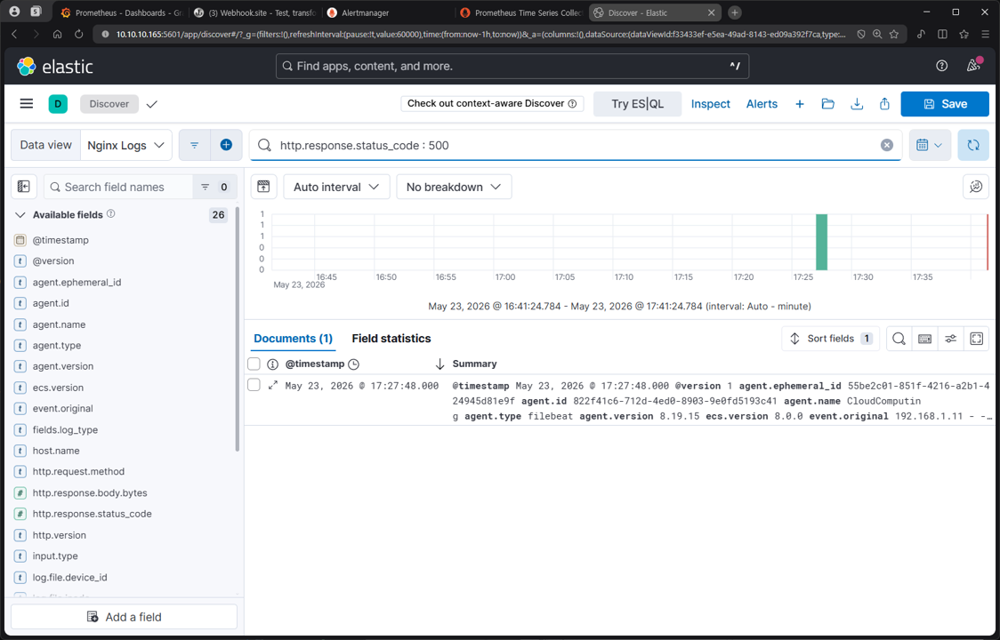

### Lens로 시각화 생성

1. 좌측 메뉴 `Analytics > Visualize Library` 진입
2. `Create visualization > Lens` 클릭
3. Data view 로 `Nginx Logs` 선택

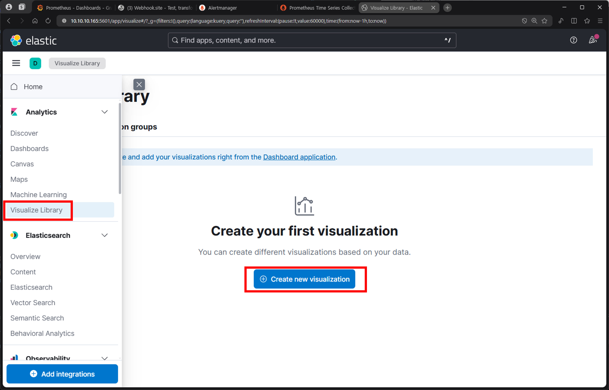
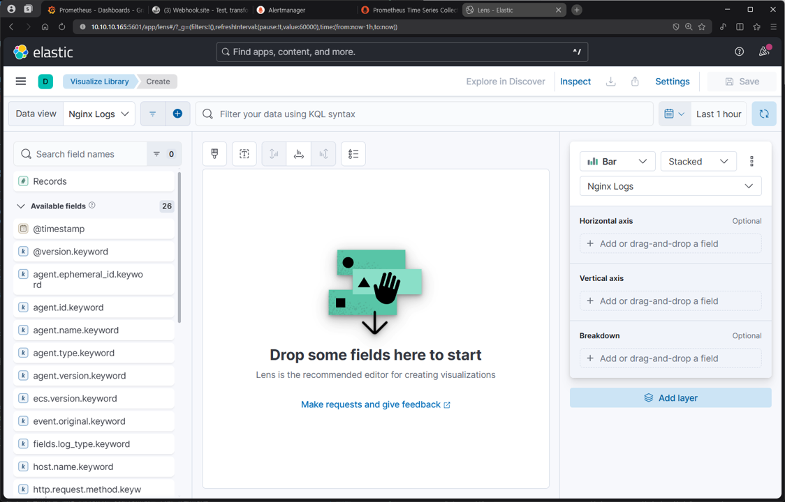

### 시각화 예시 1: 응답 상태 코드 분포 (Pie chart)

- Visualization type: `Pie`
- Slice by: `http.response.status_code` (Top values)
- Size by: `Count of records`


### 시각화 예시 2: 시간대별 요청 추이 (Bar chart)

- Visualization type: `Bar stacked`
- Horizontal axis: `@timestamp`
- Vertical axis: `Count of records`
- Break down by: `http.response.status_code`


### 시각화 예시 3: 엔드포인트별 평균 응답 크기 (Table)

- Visualization type: `Table`
- Rows: `url.original` (Top values)
- Metrics: `Average of http.response.body.bytes`

각 시각화는 `Save` 클릭하여 라이브러리에 저장

### 대시보드 구성

1. 좌측 메뉴 `Analytics > Dashboard` 진입
2. `Create dashboard` 클릭
3. `Add from library` 로 저장한 시각화들을 추가
4. 드래그로 배치 조정 후 `Save` 클릭

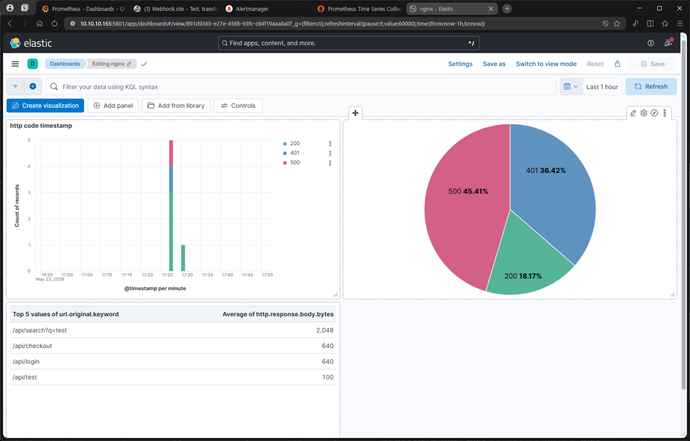

### 참고

- KQL(Kibana Query Language)은 Lucene 쿼리보다 간결하나, 복잡한 쿼리는 Lucene 모드로 전환 가능
- Data view 는 인덱스 패턴(여러 인덱스를 하나의 논리적 단위로 묶음) 위에 동작함
- 대시보드 전체는 `Share > Export` 로 NDJSON 형식으로 export 하여 다른 환경에 import 가능
- Logstash 가 `ecs_compatibility: v8` 모드로 동작하므로 nginx 필드가 ECS 표준 이름으로 저장됨 (예: `response` → `http.response.status_code`, `clientip` → `source.address`, `request` → `url.original`, `bytes` → `http.response.body.bytes`). 레거시 필드명을 쓰려면 grok 필터에 `ecs_compatibility => "disabled"` 지정

---

## 18. OpenTelemetry Collector 설치

`OpenTelemetry(OTel)` 는 메트릭, 로그, 트레이스를 벤더 중립적으로 수집/전송하는 단일 프레임워크

`OTel Collector` 는 다양한 소스에서 텔레메트리 데이터를 받아 처리한 후 여러 백엔드로 분배하는 중앙 에이전트

### 설치

```bash
# OTel Collector 의 공식 배포판인 otelcol-contrib 설치
cd ~/observability
wget https://github.com/open-telemetry/opentelemetry-collector-releases/releases/download/v0.148.0/otelcol-contrib_0.148.0_linux_amd64.deb

# 설치
sudo dpkg -i otelcol-contrib_0.148.0_linux_amd64.deb

# 서비스 등록 확인
sudo systemctl status otelcol-contrib
```

설치와 함께 `otelcol-contrib` 서비스가 자동 등록됨

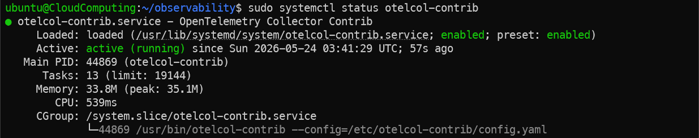

### Collector 설정 작성

`Receivers → Processors → Exporters` 의 파이프라인 구조 (이론 슬라이드 41 참고)

본 실습에서는 별도의 트레이스 시각화 백엔드(Jaeger 등) 없이, **수신한 트레이스를 메트릭으로 변환(spanmetrics connector)** 하여 Prometheus 로 노출함

이를 통해 서비스별 요청 수(Rate), 에러율(Errors), 지연 시간(Duration)의 RED 메트릭을 기존 Prometheus/Grafana 스택에서 그대로 분석 가능함

```bash
sudo tee /etc/otelcol-contrib/config.yaml > /dev/null <<EOF
receivers:
  # 애플리케이션의 OTLP 데이터 수신 (gRPC + HTTP)
  otlp:
    protocols:
      grpc:
        endpoint: 0.0.0.0:4317
      http:
        endpoint: 0.0.0.0:4318

processors:
  # 배치 처리로 전송 효율 향상
  batch:
    timeout: 5s
    send_batch_size: 512

  # spanmetrics 가 필요로 하는 속성만 남기고 리소스 스코프 정리
  # (prometheus exporter 의 single-writer 가정 위반으로 인한 중복 timestamp 오류 방지)
  transform:
    error_mode: ignore
    trace_statements:
      - context: resource
        statements:
          - keep_keys(attributes, ["service.name", "service.namespace", "deployment.environment"])

connectors:
  # 트레이스를 받아 RED 메트릭(calls, duration)으로 변환하는 커넥터
  spanmetrics:
    histogram:
      unit: ms                 # 메트릭 단위를 ms 로 고정 (생성 메트릭: duration_milliseconds_*)
      explicit:
        buckets: [100ms, 250ms, 500ms, 1s, 2s, 5s]
    dimensions:
      - name: http.method
        default: GET
      - name: http.status_code
    metrics_flush_interval: 15s

exporters:
  # 메트릭: Prometheus 가 가져갈 수 있도록 노출
  prometheus:
    endpoint: 0.0.0.0:8889
    # 리소스 속성을 메트릭 레이블로 변환
    resource_to_telemetry_conversion:
      enabled: true

  # 로그: Elasticsearch 로 전송
  elasticsearch:
    endpoints: ["http://localhost:9200"]
    logs_index: otel-logs

  # 디버깅용 표준 출력
  debug:
    verbosity: basic

service:
  pipelines:
    # 트레이스 수신 → spanmetrics 커넥터로 전달 (메트릭으로 변환됨)
    traces:
      receivers: [otlp]
      processors: [transform, batch]
      exporters: [spanmetrics, debug]

    # 메트릭 수신: 앱이 직접 보낸 OTLP 메트릭 + spanmetrics 가 생성한 메트릭
    metrics:
      receivers: [otlp, spanmetrics]
      processors: [batch]
      exporters: [prometheus, debug]

    logs:
      receivers: [otlp]
      processors: [batch]
      exporters: [elasticsearch, debug]
EOF
```

### 서비스 시작

```bash
sudo systemctl restart otelcol-contrib
sudo systemctl enable otelcol-contrib

# 상태 확인
sudo systemctl status otelcol-contrib
```

### 동작 확인

```bash
# Collector 내부 메트릭 (자체 텔레메트리)
curl http://localhost:8888/metrics | head -20

# Prometheus exporter 엔드포인트 (Collector 가 변환/수신한 메트릭이 여기로 노출됨)
# 아직 트래픽이 없으면 spanmetrics 메트릭은 비어 있음 (섹션 20 에서 생성)
curl http://localhost:8889/metrics
```

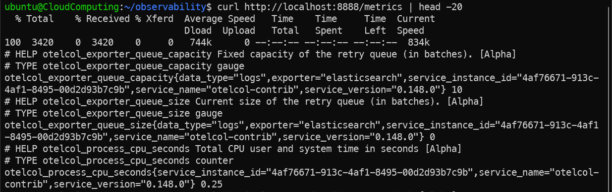

### Prometheus 가 OTel Collector 의 메트릭을 수집하도록 설정

```bash
# prometheus.yml 의 scrape_configs 에 OTel Collector 추가
sudo tee -a /etc/prometheus/prometheus.yml > /dev/null <<EOF

  - job_name: 'otel-collector'
    static_configs:
      - targets: ['localhost:8889']
EOF

curl -X POST http://localhost:9090/-/reload

# Prometheus UI 에서 OTel Collector 메트릭 수집 확인
```

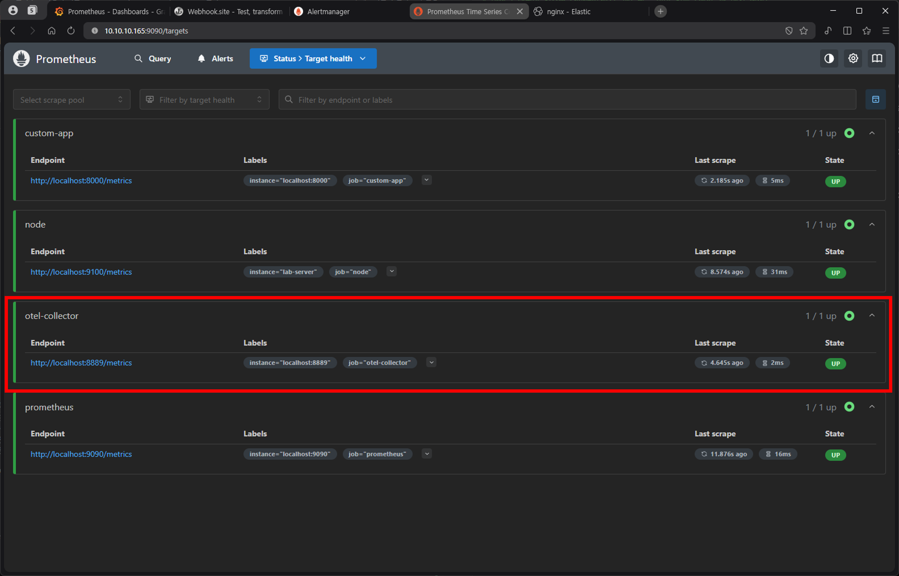

### 참고

- `otelcol-contrib` 는 다양한 vendor-specific 컴포넌트가 포함된 배포판이며, 표준 `otelcol` 보다 무거우나 호환성이 넓음
- 본 실습은 OTel Collector 를 특정 안정 버전(v0.148.0)으로 고정함 - OTel 은 약 6주 주기로 빠르게 갱신되며, 최신 버전에서는 `spanmetrics` 커넥터가 `span_metrics` 로 이름이 바뀌고 `duration` 기본 단위가 `ms` 에서 `s` 로 전환되는 변경이 진행 중이므로, 검증된 버전 고정이 재현성에 유리함
- 위 config 에서 `histogram.unit: ms` 를 명시했으므로 생성 메트릭 이름은 `duration_milliseconds_*` 로 고정됨
- Collector 는 Agent (각 호스트) 또는 Gateway (중앙 집계) 형태로 배포 가능
- **connector** 는 한 파이프라인의 출력을 다른 파이프라인의 입력으로 연결하는 컴포넌트로, `spanmetrics` 는 traces 파이프라인의 출력을 metrics 파이프라인의 입력으로 변환함
- `spanmetrics` 가 생성하는 메트릭은 `calls_total`(요청 수), `duration_*`(지연 분포) 이며 `service_name`, `span_name` 등의 레이블을 가짐
- 개별 요청의 span 트리(Gantt 차트)까지 시각화하려면 Jaeger, Tempo 같은 트레이스 전용 백엔드가 별도로 필요함

---

## 19. 분산 추적 데모 애플리케이션

OTel SDK 를 사용한 두 개의 마이크로서비스를 만들어, 서비스 간 호출이 트레이스로 수집되고 spanmetrics 를 통해 메트릭으로 변환되는 과정 확인

### Python 환경 준비

```bash
cd ~/observability
python3 -m venv otel-venv
source otel-venv/bin/activate

# OTel 자동 계측 패키지
pip install flask requests \
  opentelemetry-distro \
  opentelemetry-exporter-otlp \
  opentelemetry-instrumentation-flask \
  opentelemetry-instrumentation-requests

# 자동 계측에 필요한 추가 라이브러리 자동 설치
opentelemetry-bootstrap -a install
```

### Backend 서비스 작성

```python
cat > ~/observability/backend.py <<'EOF'
from flask import Flask, jsonify
import time
import random

app = Flask(__name__)

@app.route('/data')
def get_data():
    # 의도적인 지연 발생 (병목 시뮬레이션)
    time.sleep(random.uniform(0.1, 0.5))
    return jsonify({"value": random.randint(1, 100)})

@app.route('/slow')
def slow_endpoint():
    # 큰 지연을 발생시켜 trace 에서 식별되도록 함
    time.sleep(2)
    return jsonify({"status": "slow response"})

if __name__ == '__main__':
    app.run(host='0.0.0.0', port=5001)
EOF
```

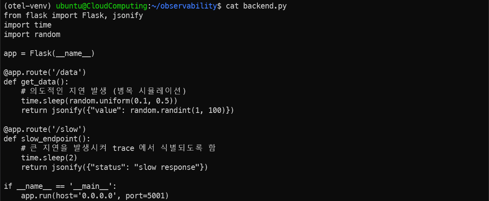

### Frontend 서비스 작성

```python
cat > ~/observability/frontend.py <<'EOF'
from flask import Flask, jsonify
import requests

app = Flask(__name__)

@app.route('/')
def index():
    # Backend 호출 - 이 호출이 trace 에서 자식 span 으로 기록됨
    resp = requests.get('http://localhost:5001/data')
    return jsonify({"frontend": "ok", "backend": resp.json()})

@app.route('/checkout')
def checkout():
    # 정상 호출 + 느린 호출을 연쇄적으로 수행
    requests.get('http://localhost:5001/data')
    resp = requests.get('http://localhost:5001/slow')
    return jsonify({"checkout": "complete", "detail": resp.json()})

if __name__ == '__main__':
    app.run(host='0.0.0.0', port=5000)
EOF
```

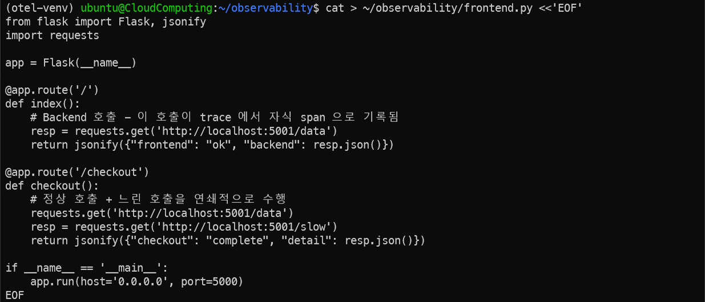

### OTel 자동 계측으로 서비스 실행

별도 터미널 2개 사용

**터미널 1 (Backend):**

```bash
cd ~/observability
source otel-venv/bin/activate

OTEL_SERVICE_NAME=backend-service \
OTEL_EXPORTER_OTLP_ENDPOINT=http://localhost:4317 \
OTEL_EXPORTER_OTLP_PROTOCOL=grpc \
OTEL_TRACES_EXPORTER=otlp \
OTEL_METRICS_EXPORTER=otlp \
OTEL_LOGS_EXPORTER=otlp \
opentelemetry-instrument python3 backend.py
```

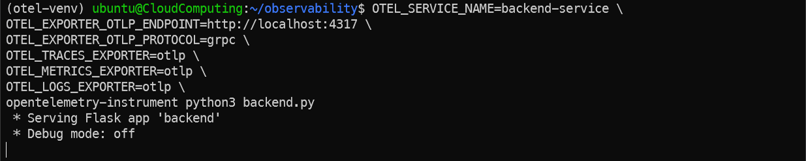

**터미널 2 (Frontend):**

```bash
cd ~/observability
source otel-venv/bin/activate

OTEL_SERVICE_NAME=frontend-service \
OTEL_EXPORTER_OTLP_ENDPOINT=http://localhost:4317 \
OTEL_EXPORTER_OTLP_PROTOCOL=grpc \
OTEL_TRACES_EXPORTER=otlp \
OTEL_METRICS_EXPORTER=otlp \
OTEL_LOGS_EXPORTER=otlp \
opentelemetry-instrument python3 frontend.py
```

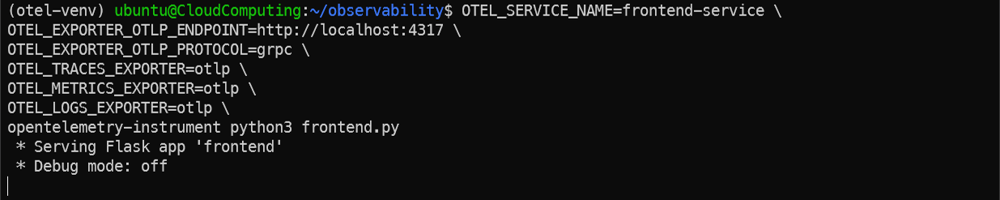

### 트래픽 발생

별도 터미널 3에서 요청을 반복 전송하여 trace 를 생성 (spanmetrics 집계를 위해 충분한 표본 필요)

```bash
# 정상 요청 30회
for i in {1..30}; do curl -s http://localhost:5000/ > /dev/null; done

# 느린 요청(checkout) 20회 - /slow 호출이 포함되어 지연 발생
for i in {1..20}; do curl -s http://localhost:5000/checkout > /dev/null; done
```

### Collector 가 변환한 spanmetrics 확인

OTel Collector 가 수신한 트레이스를 메트릭으로 변환하여 `:8889` 로 노출함

```bash
# spanmetrics 가 생성한 메트릭 확인 (calls, duration)
curl -s http://localhost:8889/metrics | grep -E 'calls_total|duration|frontend|backend'
```

`frontend-service`, `backend-service` 별로 `calls_total` 과 `duration_*` 메트릭이 노출되는 것 확인

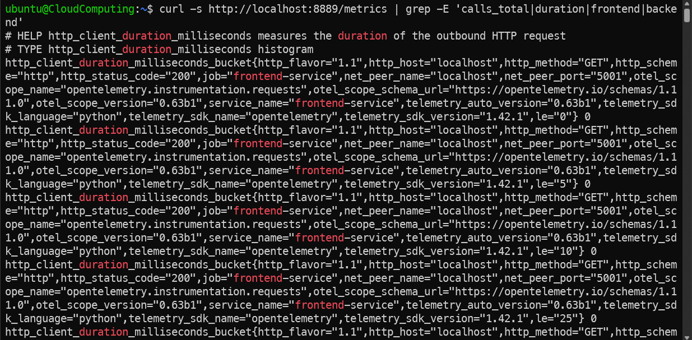

### Prometheus 에서 트레이스 기반 메트릭 조회

Prometheus UI (`:9090`) 에서 다음 쿼리 실행:

```promql
# 서비스별 초당 요청 수
sum by (service_name) (rate(traces_span_metrics_calls_total[1m]))

# 서비스별 평균 응답 시간 (ms)
sum by (service_name) (rate(traces_span_metrics_duration_milliseconds_sum[1m]))
  / sum by (service_name) (rate(traces_span_metrics_duration_milliseconds_count[1m]))

# span 별 P95 지연 시간 (ms)
histogram_quantile(0.95, sum by (le, span_name) (rate(traces_span_metrics_duration_milliseconds_bucket[1m])))
```

### Grafana 대시보드에 트레이스 메트릭 패널 추가

섹션 8에서 만든 대시보드에 패널 추가:

- **패널: 서비스별 요청률** — 쿼리 `sum by (service_name) (rate(traces_span_metrics_calls_total[1m]))`, Time series
- **패널: span 별 P95 지연** — 쿼리 `histogram_quantile(0.95, sum by (le, span_name) (rate(traces_span_metrics_duration_milliseconds_bucket[1m])))`, Time series, Unit: milliseconds

`/slow` span(`backend-service`)의 지연이 다른 span 보다 현저히 높게 나타나는 것을 시각적으로 확인 (의도적으로 삽입한 `time.sleep(2)` 때문에 약 2000ms)

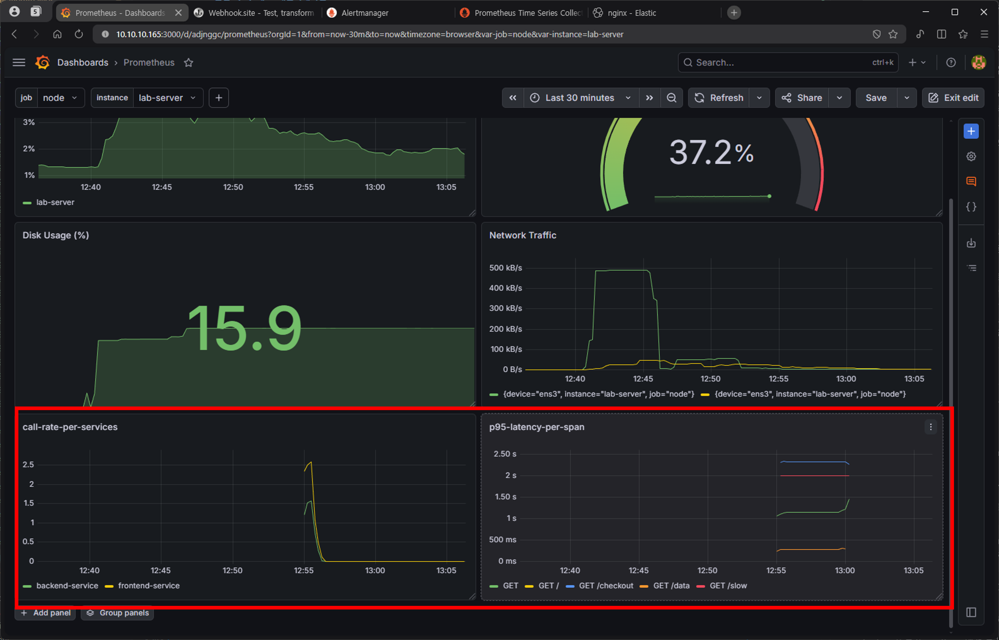

### 참고

- `opentelemetry-instrument` 명령어는 Python 애플리케이션을 자동으로 계측하여 코드 수정 없이 trace 를 생성함
- 환경 변수 `OTEL_*` 로 모든 동작을 제어할 수 있음 - 코드에 vendor lock-in 없음
- `requests` 라이브러리 자동 계측이 HTTP 헤더 `traceparent` 를 통해 trace ID 를 전파함 (W3C Trace Context 표준)
- spanmetrics 가 생성하는 메트릭은 Prometheus 노출 시 `traces_span_metrics_` 접두사가 붙음 (`traces_span_metrics_calls_total`, `traces_span_metrics_duration_milliseconds_bucket`). 접두사를 바꾸려면 connector 의 `namespace` 설정을 조정함
- spanmetrics 는 개별 trace 가 아닌 **집계된 RED 메트릭**을 제공함 - 어느 서비스/구간이 느린지는 알 수 있으나, 단일 요청의 전체 경로(Gantt 차트)를 보려면 Jaeger 같은 트레이스 백엔드가 필요함
- 더 세밀한 제어가 필요하면 코드에서 `tracer.start_as_current_span()` 으로 수동 계측 가능

---

## 20. 심화 과제(한번 해볼만한 과제들)

### 과제 1. Service Discovery 적용

현재 `static_configs` 로 하드코딩된 Prometheus 수집 대상을, 파일 기반 서비스 디스커버리(`file_sd_configs`)로 변경하여 타겟 추가 시 Prometheus 재로드 없이 자동 인식되도록 구성

### 과제 2. Recording Rules

자주 사용되는 복잡한 PromQL 쿼리(예: 에러율, P99)를 사전 계산하여 새 메트릭으로 저장하는 Recording Rule 을 작성하고, 대시보드에서 활용

### 과제 3. Filebeat -> Elasticsearch 직접 전송

Logstash 를 거치지 않고 Filebeat 가 ES 로 직접 데이터를 전송하도록 구성하고, Logstash 경유와 비교한 장단점 분석

### 과제 4. OTel Collector 다중 분기

spanmetrics 커넥터의 버킷 경계와 dimensions(레이블)를 조정하여, 더 세밀한 지연 분포와 HTTP 메서드별 분리 집계가 가능하도록 Collector 파이프라인을 수정

### 과제 5. Alert 라우팅 분기

`severity: critical` 알림은 webhook 으로, `severity: warning` 알림은 로그 파일로 분리되도록 Alertmanager `route` 트리를 구성

---

## Q & A

박찬욱
<cupark@dankook.ac.kr>

남재현
<namjh@dankook.ac.kr>

## Networked Systems and Security Lab (BoanLab) @ DKU