# 클라우드 가상화 기술

## 오픈스택 실습

- 가상 머신 1대를 준비하여 단일 노드(All-in-One) 환경으로 OpenStack 설치
- 설치 도구는 OpenStack 공식 개발/평가용 도구인 `DevStack` 사용
- OpenStack 릴리스는 `2026.1 Gazpacho` (최신 안정 버전)
- DevStack은 빠른 설치 및 개발을 위한 도구로, 운영 환경에서는 `Packstack`, `Kolla`, `Ansible` 등 다른 설치 방법 권장

---

## 1. 실습 환경 준비

- SOLID CLOUD 환경에서 아래 사양의 가상 머신을 1대 준비
- 단일 NIC, 정적 IP 권장

| 항목 | 권장 사양 |
|------|----------|
| OS | Ubuntu 24.04 LTS (Noble) |
| vCPU | 4 core 이상 |
| RAM | 16 GB 이상 |
| Disk | 80 GB 이상 |
| Network | 외부 통신 가능한 단일 NIC |

### 참고
- DevStack은 시스템에 광범위한 변경을 가하므로 반드시 `실습 전용 VM`에서만 사용
- SOLID CLOUD의 KVM 위에 OpenStack의 KVM이 동작하므로 `Nested Virtualization` 구조
- Nested 미지원 시 QEMU 에뮬레이션 모드로 동작 가능 (성능 저하)

---

## 2. CPU 가상화 지원 확인

```bash
# 호스트 KVM 모듈의 nested 가상화 허용 여부 확인
cat /sys/module/kvm_intel/parameters/nested
```

```bash
# 현재 VM에서 KVM 디바이스 노출 여부 확인
ls /dev/kvm
```

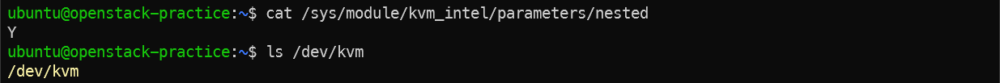

### 참고
- `Y` (또는 `1`) 출력 시 nested 가상화 허용됨
- `/dev/kvm`이 존재하면 현재 VM에서 KVM 가속 사용 가능
- 둘 중 하나라도 만족하지 않으면 `local.conf`에 `LIBVIRT_TYPE=qemu`로 설정하여 QEMU 에뮬레이션 모드로 진행 (성능 저하)

---

## 3. 사전 패키지 설치

```bash
# 패키지 인덱스 업데이트
sudo apt update && sudo apt -y upgrade

# 기본 도구 설치
sudo apt install -y git net-tools curl vim
```

---

## 4. stack 사용자 생성

- DevStack은 보안상 root가 아닌 별도의 일반 사용자로 실행해야 함
- 해당 사용자에게 비밀번호 없는 sudo 권한 부여 필요

```bash
# stack 사용자 생성 (홈 디렉토리: /opt/stack)
sudo useradd -s /bin/bash -d /opt/stack -m stack

# 홈 디렉토리에 실행 권한 부여 (Ubuntu 21.04+ 기본 700 → 755로 조정)
sudo chmod +x /opt/stack

# sudoers에 stack 사용자 추가
echo "stack ALL=(ALL) NOPASSWD: ALL" | sudo tee /etc/sudoers.d/stack
sudo chmod 0440 /etc/sudoers.d/stack

# stack 사용자로 전환
sudo -u stack -i
```

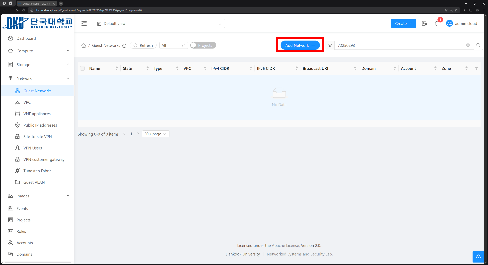

---

## 5. DevStack 소스코드 다운로드

```bash
# stack 사용자 홈 디렉토리에서 수행
cd /opt/stack
pwd  # /opt/stack

# DevStack 공식 저장소 클론
git clone https://opendev.org/openstack/devstack
cd devstack

# 2026.1 Gazpacho 안정 브랜치로 체크아웃
git checkout stable/2026.1
```
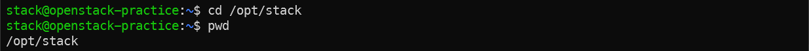
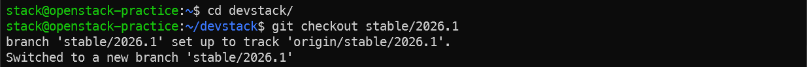

### 참고
- DevStack 브랜치 종류
  - `master` - 매일 변동되는 개발 버전 (실험용)
  - `stable/2026.1` - Gazpacho 안정 버전 (실습 권장)
  - `stable/2025.2` - Flamingo 이전 안정 버전

---

## 6. local.conf 작성

- DevStack은 `local.conf` 파일을 통해 설치 동작을 제어
- 비밀번호 4종(`ADMIN/DATABASE/RABBIT/SERVICE`)이 최소 필수 항목

```bash
# devstack 디렉토리에서 수행
# [VM_IP]는 현재 VM의 실제 IP 주소로 변경
cat > /opt/stack/devstack/local.conf <<EOF
[[local|localrc]]
# 비밀번호 (영문 + 숫자만 사용, 특수문자 금지)
ADMIN_PASSWORD=secret
DATABASE_PASSWORD=\$ADMIN_PASSWORD
RABBIT_PASSWORD=\$ADMIN_PASSWORD
SERVICE_PASSWORD=\$ADMIN_PASSWORD

# 네트워크 설정
HOST_IP=[VM_IP]
FLOATING_RANGE=172.24.4.0/24
FIXED_RANGE=192.168.100.0/24
Q_FLOATING_ALLOCATION_POOL=start=172.24.4.100,end=172.24.4.200
PUBLIC_NETWORK_GATEWAY=172.24.4.1

# 추가 서비스: Swift (오브젝트 스토리지)
enable_service s-proxy s-object s-container s-account
SWIFT_HASH=66a3d6b56c1f479c8b4e70ab5c2b9a08
SWIFT_REPLICAS=1

# 추가 서비스: Heat (오케스트레이션)
enable_plugin heat https://opendev.org/openstack/heat stable/2026.1

# 차세대 대시보드 Skyline (Horizon과 함께 동작)
enable_plugin skyline-apiserver https://opendev.org/openstack/skyline-apiserver stable/2026.1

# Nested 미지원 시 주석 해제 (KVM → QEMU 폴백)
# LIBVIRT_TYPE=qemu

# 로그 설정
LOGFILE=/opt/stack/logs/stack.sh.log
LOGDAYS=2
EOF
```

### 참고
- `ADMIN_PASSWORD` : Horizon/Skyline 로그인(`admin`, `demo` 공통) 및 모든 API 접근에 사용되는 마스터 비밀번호
- `FLOATING_RANGE` : VM에 매핑할 외부 통신용 IP 대역. DevStack VM 내부의 `br-ex` 가상 브리지에서만 통하므로, CloudStack 호스트 대역(`10.0.0.0/16`)과 겹치지 않도록 `172.24.4.0/24` 사용
- `FIXED_RANGE` : 테넌트 VM 내부 사설 IP 대역. Neutron이 network namespace로 격리
- `SWIFT_REPLICAS=1` : 단일 노드 환경에서는 복제본 1개 (운영 환경은 기본 3)

---

## 7. DevStack 설치

```bash
# devstack 디렉토리에서 수행
cd /opt/stack/devstack

# 설치 실행 (약 20~40분 소요 -> VM 사양과 네트워크 속도에 따라 달라짐)
./stack.sh
```

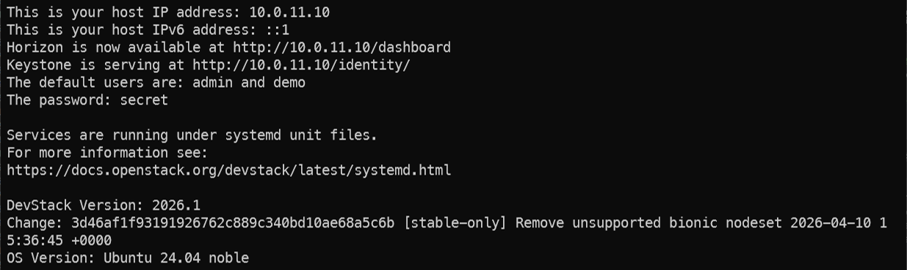

### 참고
- 설치 오류 발생 시 `/opt/stack/logs/stack.sh.log` 확인
- 부분 재시도가 필요한 경우 `./unstack.sh` 후 `./stack.sh` 재실행
- 완전 초기화는 `./clean.sh` 후 진행
- 설치 시간은 VM 사양과 외부 네트워크 속도에 크게 영향받음

---

## 8. 인증 정보 로드 및 토큰 발급

- DevStack은 `openrc` 파일로 OpenStack 인증 환경 변수를 셸에 주입
- 첫 번째 인자는 사용자명, 두 번째는 프로젝트명

```bash
cd /opt/stack/devstack

# admin 계정으로 환경 변수 로드 (관리자 권한)
source openrc admin admin

# 현재 인증 토큰 발급 및 확인
openstack token issue
```

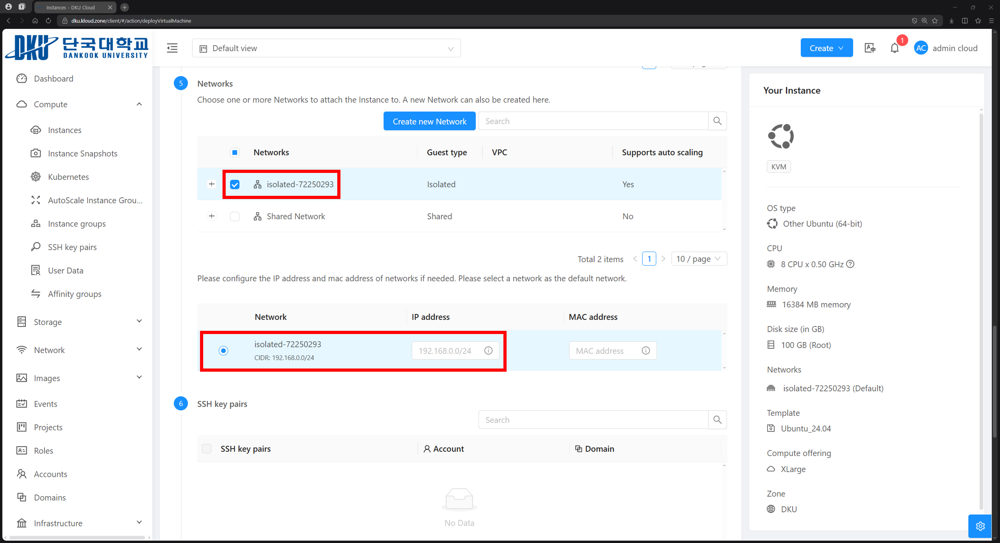

```bash
# OpenStack 서비스 카탈로그(엔드포인트) 확인
openstack catalog list

# 등록된 서비스 목록 확인
openstack service list
```

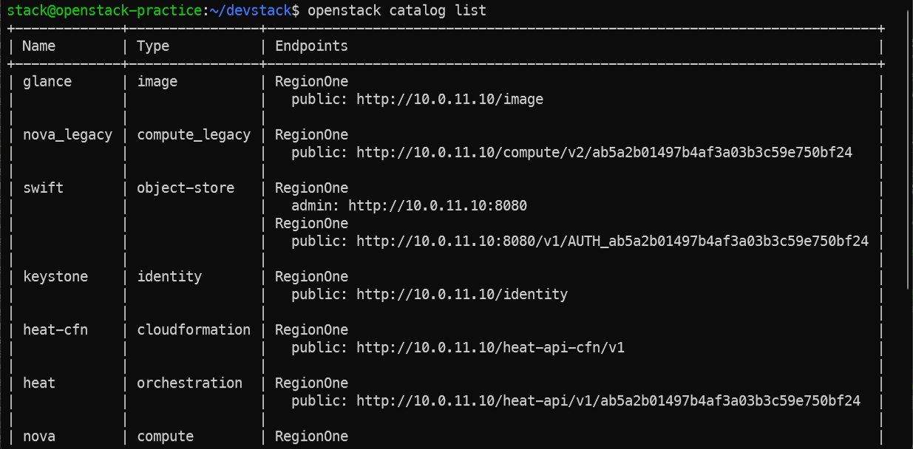
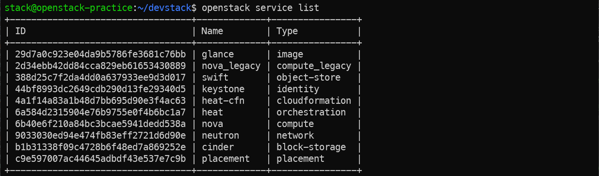

### 참고
- `openstack token issue` 응답의 `id` 값이 `Fernet Token`이며, 약 255바이트 크기의 암호화 문자열
- 토큰의 기본 유효기간(TTL)은 1시간
- demo 사용자로 전환 시 `source openrc demo demo`

---

## 9. Keystone - 도메인 / 프로젝트 / 사용자 / 역할

`Keystone`은 OpenStack의 인증/인가 서비스로, 멀티테넌시 계층 구조를 통해 자원을 격리

- **Domain** : 가장 상위 격리 경계 (조직 단위)
- **Project** : 자원이 실제 할당되는 단위 (팀 단위)
- **User** : 시스템 접근 주체
- **Role** : 권한 집합 (`admin`, `member`, `reader`)

```bash
# admin 권한 로드
source openrc admin admin
```

```bash
# 1. 도메인 생성 (조직 단위)
openstack domain create --description "Dankook University" dku

# 2. 프로젝트 생성 (해당 도메인 내 팀 단위)
openstack project create --domain dku \
  --description "Cloud Virtualization Lab" cloud-lab

# 3. 사용자 생성
openstack user create --domain dku \
  --project cloud-lab --project-domain dku \
  --password "userpass" \
  --description "Lab student" student

# 4. 역할(Role) 부여
openstack role add --project cloud-lab --project-domain dku \
  --user student --user-domain dku \
  member
```

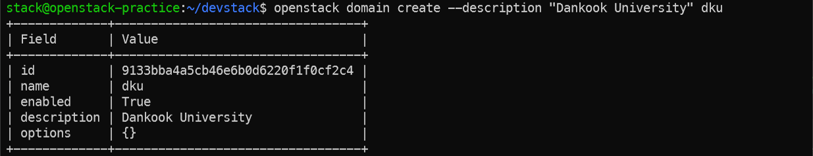
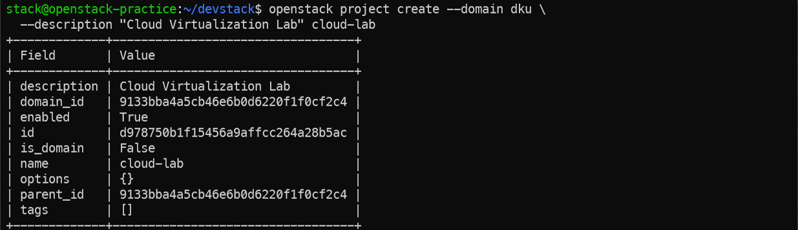
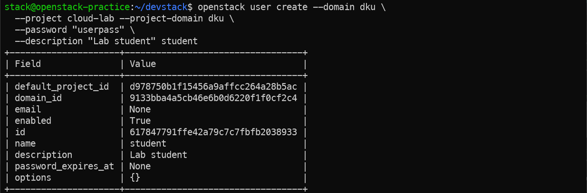

```bash
# 생성된 자원 확인
openstack domain list
openstack project list --domain dku
openstack user list --domain dku
openstack role assignment list --user student --user-domain dku --names
```

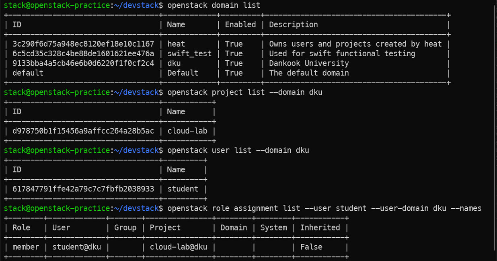


### 참고
- 도메인을 명시하지 않으면 기본 도메인(`default`)에 생성됨
- 한 사용자가 여러 프로젝트에 다양한 역할로 매핑 가능
- 운영 환경에서는 LDAP/AD를 Identity Backend로 연동하여 사용자 정보를 외부에서 관리

---

## 10. Fernet Token 및 Key Rotation

- Fernet Token은 DB 저장 없이 토큰 자체에 정보를 포함하는 상태 비저장(Stateless) 방식
- 대칭키(Fernet Key)로 암호화/복호화되며, 보안을 위해 주기적인 키 교체(Rotation) 필요

```bash
# Keystone Fernet 키 저장소 확인
sudo ls -la /etc/keystone/fernet-keys/
```
출력 예시
```
-rw------- 1 keystone keystone 44 May 14 10:00 0   # Staged Key (대기 키)
-rw------- 1 keystone keystone 44 May 14 10:00 1   # Primary Key (주 키)
```

```bash
# 현재 토큰 발급 후 길이 확인
TOKEN=$(openstack token issue -f value -c id)
echo "Token length: ${#TOKEN}"
echo "Token prefix: ${TOKEN:0:50}..."
```

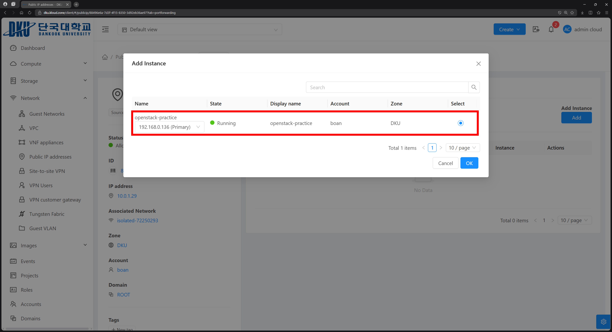

```bash
# Key Rotation 수행
sudo keystone-manage fernet_rotate --keystone-user stack --keystone-group stack

# 키 목록 재확인 (Staged → Primary로 승격, 기존 Primary는 Secondary로 강등)
sudo ls -la /etc/keystone/fernet-keys/
```

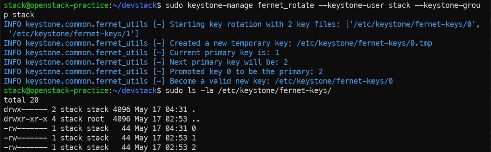

```bash
# 회전 전 발급된 기존 토큰이 여전히 검증 가능한지 확인
curl -s -o /dev/null -w "HTTP %{http_code}\n" \
  -H "X-Auth-Token: $TOKEN" \
  -H "X-Subject-Token: $TOKEN" \
  http://10.0.11.10/identity/v3/auth/tokens

# HTTP 200 → 유효 (Secondary 키로 정상 검증됨)
# HTTP 401 → 무효
```

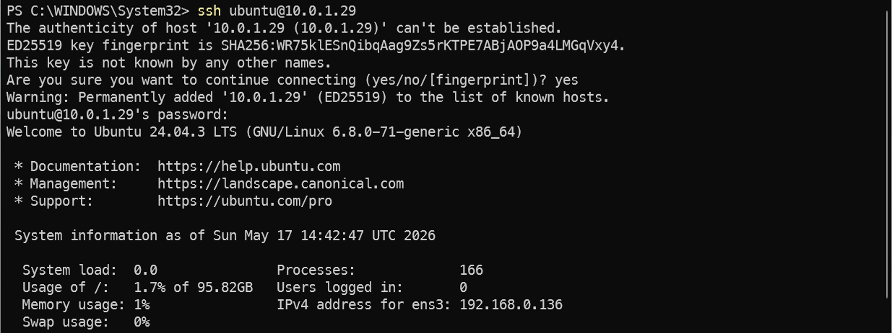

### 참고
- **Primary Key (주 키)** : 새 토큰을 암호화/발급할 때 사용 (가장 큰 인덱스)
- **Secondary Key (보조 키)** : 이전에 발급된 토큰을 복호화/검증할 때만 사용
- **Staged Key (대기 키)** : 다음 회전에서 Primary로 승격될 후보 (항상 인덱스 `0`)
- DevStack 환경에서는 모든 OpenStack 서비스가 `stack` 사용자 계정으로 동작하므로  
  `--keystone-user stack --keystone-group stack` 사용 (운영 환경 표준 패키지는 `keystone:keystone`)
- 다중 노드 환경에서는 모든 Keystone 노드가 동일한 키 셋을 유지해야 함
- 토큰 검증은 Keystone의 `/v3/auth/tokens` 엔드포인트에 `X-Auth-Token`(요청자 인증)과 `X-Subject-Token`(검증 대상 토큰) 헤더로 GET 요청하여 수행
- NTP 동기화가 필수 (노드 간 시간 차이로 인한 토큰 만료 판단 오류 방지)
- 운영 환경에서는 `cron`으로 자동 회전 권장 (예: `0 */6 * * *`)

---

## 11. Glance - VM 이미지 관리

`Glance`는 VM 부팅용 디스크 이미지를 검색, 등록, 조회하는 서비스

```bash
source openrc admin admin

# 기본 등록된 이미지 확인 (DevStack이 CirrOS 자동 등록)
openstack image list
```

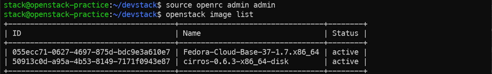

```bash
# Ubuntu 24.04 Cloud 이미지 다운로드 (QCOW2 포맷)
cd /tmp
wget https://cloud-images.ubuntu.com/noble/current/noble-server-cloudimg-amd64.img

# Glance에 이미지 등록
openstack image create "ubuntu-24.04" \
  --file noble-server-cloudimg-amd64.img \
  --disk-format qcow2 \
  --container-format bare \
  --public

# 이미지 상세 정보 확인
openstack image show ubuntu-24.04
```

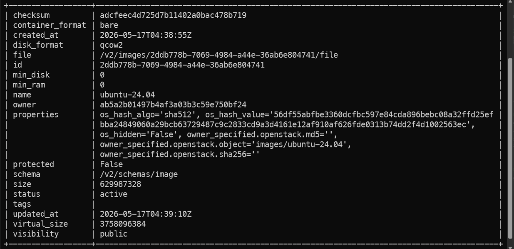

```bash
# 이미지 메타데이터 추가
openstack image set ubuntu-24.04 \
  --property os_distro=ubuntu \
  --property os_version=24.04 \
  --property hw_disk_bus=virtio
```

### 참고
- 지원 이미지 포맷
  - `QCOW2` : KVM 권장. 스냅샷 및 압축 효율적
  - `RAW` : 압축 없음. I/O 성능 우수, 용량 큼
  - `VMDK` : VMware 호환
  - `ISO` : 설치 미디어 형태
- `--public` : 모든 프로젝트에서 사용 가능 (관리자 권한 필요)
- `--private` : 소속 프로젝트 전용
- DevStack 기본 백엔드는 로컬 파일시스템(`/opt/stack/data/glance/images/`)

---

## 12. Placement - 자원 인벤토리 확인

`Placement`는 클라우드 내 자원(CPU, 메모리, 디스크)의 인벤토리와 사용량을 추적하는 API 서비스

```bash
# 자원 공급자(Resource Provider) 목록
openstack resource provider list
```

```bash
# 특정 공급자(컴퓨트 노드)의 자원 인벤토리 확인
RP_UUID=$(openstack resource provider list -f value -c uuid | head -1)
openstack resource provider inventory list $RP_UUID
```

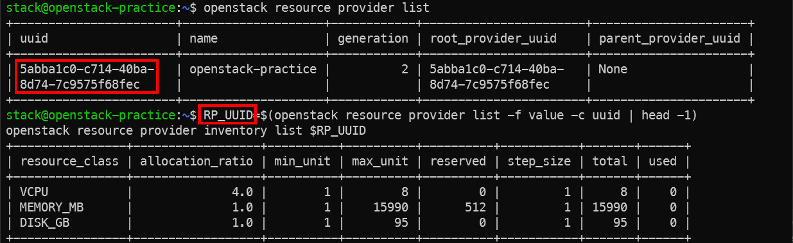

```bash
# 현재 자원 할당(Allocation) 상태 확인
openstack resource provider show $RP_UUID --allocations

# 공급자의 특성(Trait) 확인
openstack resource provider trait list $RP_UUID
```

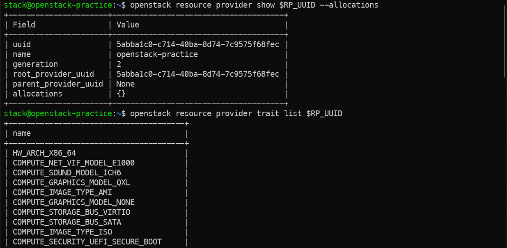

### 참고
- **Resource Class** : 추적 가능한 자원의 종류
  - 기본 제공: `VCPU` (가상 CPU 코어), `MEMORY_MB` (메모리 MB), `DISK_GB` (디스크 GB)
  - 표준 확장: `PCPU` (전용 물리 코어), `PGPU` (가상 GPU), `NET_BW_EGR_KILOBIT_PER_SEC` (네트워크 대역폭)
  - 사용자 정의: `CUSTOM_` 접두사로 자유롭게 추가 (예: `CUSTOM_GPU_A100`, `CUSTOM_FPGA`, `CUSTOM_NVME`)
- **Allocation Ratio** : 물리 자원 대비 가상 자원 할당 배수 (오버커밋)
  - `VCPU: 16.0` → 물리 코어 1개를 가상 코어 16개로 할당 가능. CPU는 시분할 가능하므로 대부분 오버커밋 설정
  - `MEMORY_MB: 1.5` → 물리 RAM 100GB를 150GB로 할당 가능. 과도하면 OOM 발생 위험
  - `DISK_GB: 1.0` → 디스크는 오버커밋 안 함이 일반적 (실제 데이터 점유)
  - 운영 환경에서는 워크로드 특성에 따라 조정 (예: 일반 웹 서비스 `VCPU: 4.0`, AI 학습 `VCPU: 1.0`)
- **Trait** : 자원의 정성적 특성 (있다/없다 형태의 boolean)
  - 표준 Trait: `HW_CPU_X86_AVX2` (AVX2 명령어 지원), `HW_CPU_HYPERTHREADING`, `STORAGE_DISK_SSD`, `COMPUTE_VOLUME_MULTI_ATTACH`
  - 보안/규제: `HW_CPU_X86_INTEL_VTX` (Intel VT-x), `COMPUTE_SECURITY_TPM_2_0` (TPM 2.0 탑재)
  - 사용자 정의: `CUSTOM_` 접두사 (예: `CUSTOM_RACK_A1`, `CUSTOM_GPU_NVIDIA_A100`)
- **Inventory vs Allocation** : 인벤토리는 노드가 보유한 자원 총량, 할당은 특정 VM(소비자)에게 실제로 부여된 양
  - `openstack resource provider inventory list` : 노드별 자원 총량/오버커밋/사용 가능 단위
  - `openstack resource provider show --allocations` : 현재 어떤 소비자가 얼마나 점유 중인지 추적
- **Nova Scheduler 연동** : VM 생성 시 다음 흐름으로 동작
  1. Nova가 사용자 요청(예: VCPU=2, RAM=4GB, `trait:HW_CPU_X86_AVX2=required`)을 Placement에 전달
  2. Placement가 조건을 만족하는 Resource Provider만 추려서 후보 목록 반환
  3. Nova가 후보 중 가중치(Weigher) 계산 후 최종 노드 선정
  4. 선정된 노드에 자원 할당(Allocation) 기록
- 모든 노드를 일일이 조회하지 않고 Placement가 1차 필터링하므로 수백~수천 노드 환경에서도 빠르게 스케줄링 가능

---

## 13. Nova - Flavor 및 Key Pair 준비

VM 생성 전 인스턴스 크기 정의(`Flavor`)와 SSH 접속용 키페어 준비

```bash
cd /opt/stack/devstack
source openrc admin admin

# 기본 Flavor 목록 확인
openstack flavor list

# 실습용 Flavor 생성 (1 vCPU, 1GB RAM, 10GB Disk)
openstack flavor create --vcpus 1 --ram 1024 --disk 10 lab.small
```

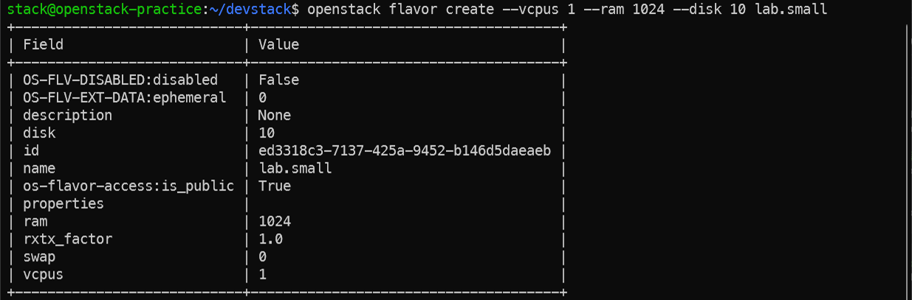

```bash
# 일반 사용자(demo)로 전환
source openrc demo demo

# SSH 키페어 생성
ssh-keygen -t rsa -b 2048 -N "" -f ~/.ssh/id_rsa_lab

# Nova에 공개키 등록
openstack keypair create --public-key ~/.ssh/id_rsa_lab.pub lab-keypair

# 등록 확인
openstack keypair list
```

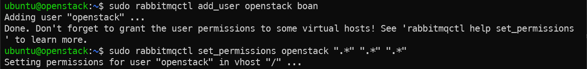

### 참고
- Flavor는 인스턴스 템플릿으로 vCPU/RAM/Disk 외에도 `--ephemeral`, `--swap`, `--property` 등 부여 가능
- DevStack 기본 Flavor : `m1.tiny`, `m1.small`, `m1.medium`, `m1.large`, `m1.xlarge`
- 키페어는 사용자별로 등록되며, 동일 키페어를 여러 VM에 재사용 가능

---

## 14. Neutron - 가상 네트워크 구성

`Neutron`은 SDN 기반으로 가상 네트워크를 프로비저닝하는 서비스. 다음 5단계로 테넌트 네트워크를 구성

### 14-1. 테넌트 네트워크(내부) 생성

```bash
source openrc demo demo

# 내부 네트워크 생성
openstack network create internal-net
```

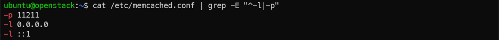

### 14-2. 서브넷 설정 (DHCP 자동 활성화)

```bash
# 서브넷 생성
openstack subnet create internal-subnet \
  --network internal-net \
  --subnet-range 192.168.100.0/24 \
  --dns-nameserver 8.8.8.8
```

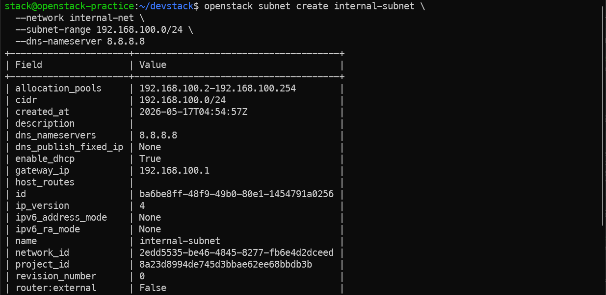

### 14-3. 라우터 생성

```bash
# 가상 라우터 생성
openstack router create lab-router
```

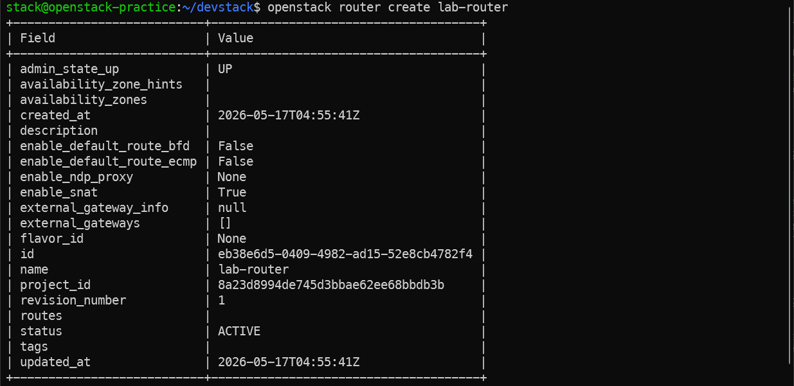

### 14-4. 내부 네트워크와 라우터 연결

```bash
# 라우터에 내부 서브넷 인터페이스 추가
openstack router add subnet lab-router internal-subnet
```

### 14-5. 외부 네트워크와 라우터 연결

```bash
# 외부 네트워크 확인 (DevStack이 기본 생성한 'public')
openstack network list --external

# 라우터의 외부 게이트웨이 설정
openstack router set lab-router --external-gateway public
```

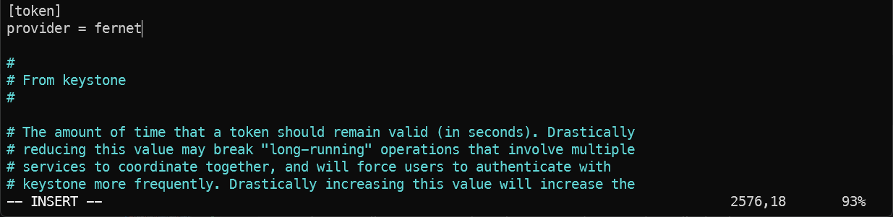

```bash
# 구성 결과 종합 확인
openstack network list
openstack subnet list
openstack router show lab-router
```

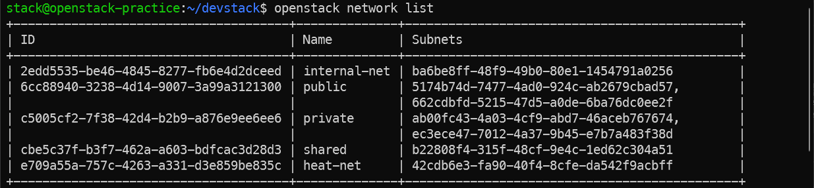
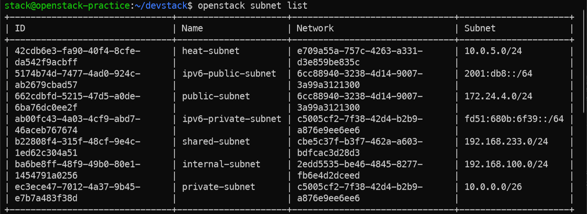
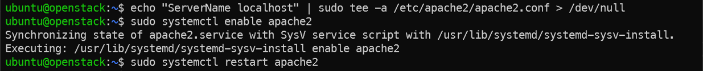

### 참고
- 서브넷 생성 시 자동으로 DHCP 서버가 활성화되어 VM 부팅 시 자동 IP 할당
- 라우터는 내부적으로 L3 에이전트(또는 OVN의 분산 라우팅)로 동작
- DevStack은 설치 시 `public` 외부 네트워크와 `shared` 내부 네트워크를 자동 생성
- 프로젝트 간 IP 대역이 겹쳐도(`192.168.100.0/24` 공통 사용) 테넌트별 네트워크 네임스페이스로 격리됨

---

## 15. Nova - VM 인스턴스 생성

```bash
source openrc demo demo

# 보안 그룹 생성
openstack security group create lab-secgroup --description "Lab access"

# SSH(22), ICMP 허용 규칙 추가
openstack security group rule create lab-secgroup --protocol tcp --dst-port 22 --remote-ip 0.0.0.0/0
openstack security group rule create lab-secgroup --protocol icmp --remote-ip 0.0.0.0/0
```

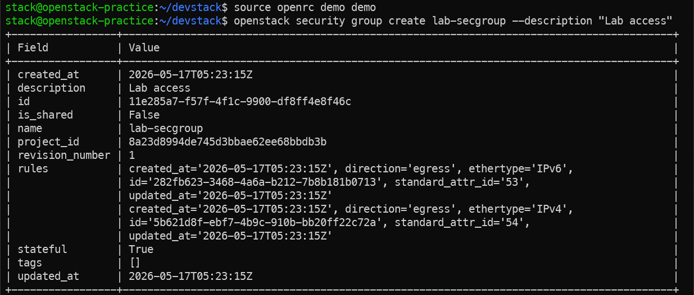
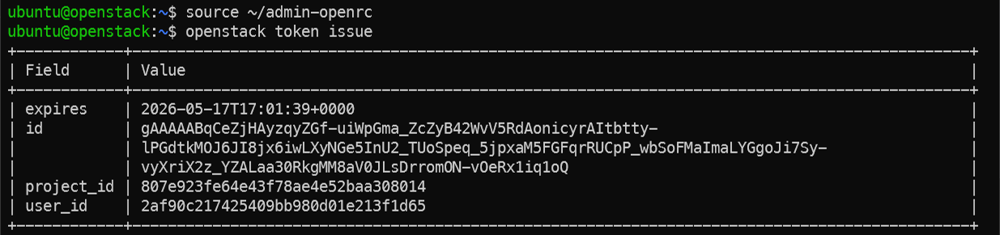
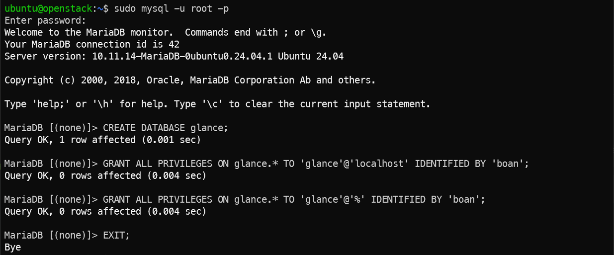

```bash
# 내부 네트워크 ID 확인(internal-net 네트워크 이름 대신 ID 사용 권장)
NET_ID=$(openstack network show internal-net -f value -c id)

# VM 인스턴스 생성
openstack server create lab-vm-01 \
  --flavor lab.small \
  --image cirros-0.6.3-x86_64-disk \
  --network $NET_ID \
  --key-name lab-keypair \
  --security-group lab-secgroup
```

```bash
# 상태가 BUILD → ACTIVE로 변하는 과정 모니터링
watch -n 1 'openstack server show lab-vm-01 -f value -c status -c OS-EXT-STS:vm_state'
```

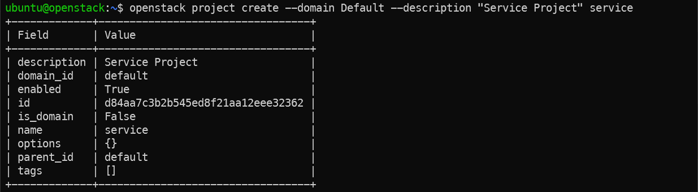

### 참고
- VM 상태 전환 흐름
  - `BUILD` : 리소스 스케줄링, 이미지 다운로드, 네트워크 포트 바인딩 진행 중
  - `ACTIVE` : 정상 실행
  - `PAUSED` : 메모리 유지, CPU만 정지 (빠른 재개 가능)
  - `SHUTOFF` : 완전 종료, 리소스 일부 회수
  - `ERROR` : 호스트 장애 또는 스케줄링 실패

---

## 16. VM 라이프사이클 관리

```bash
# 일시 정지 (메모리 유지)
openstack server pause lab-vm-01
openstack server show lab-vm-01 -f value -c status

# 재개
openstack server unpause lab-vm-01
openstack server show lab-vm-01 -f value -c status

# 전원 종료
openstack server stop lab-vm-01
openstack server show lab-vm-01 -f value -c status

# 재시작
openstack server start lab-vm-01
openstack server show lab-vm-01 -f value -c status

# 스냅샷 생성 (현재 디스크 상태를 Glance 이미지로 저장)
openstack server image create --name lab-vm-01-snap lab-vm-01
openstack image list 
# 다른 Glance 이미지와 함께 snap 이미지가 출력됨
```

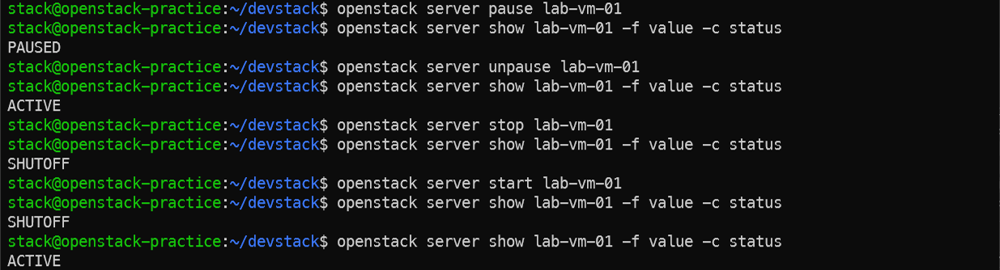
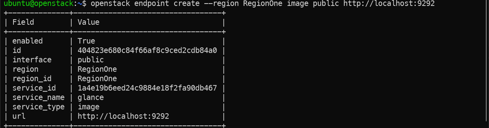

### 참고
- VM 생성 실패 시 트러블슈팅
  - `NoValidHost` 오류 → Placement에 가용 자원 부족, `nova-scheduler` 로그 확인
  - 이미지 다운로드 실패 → `glance-api` 로그 확인
  - 네트워크 바인딩 실패 → `neutron-server` 로그 및 OVN/OVS 상태 확인

---

## 17. Floating IP 및 보안 그룹

`Floating IP`는 외부 네트워크와 통신하기 위한 공인 IP로, 가상 라우터에서 NAT를 통해 VM 사설 IP와 1:1 매핑

```bash
# 외부 네트워크(public)에서 플로팅 IP 할당
FLOATING_IP=$(openstack floating ip create public -f value -c floating_ip_address)
echo "Allocated Floating IP: $FLOATING_IP"

# VM에 플로팅 IP 매핑
openstack server add floating ip lab-vm-01 $FLOATING_IP

# 매핑 확인
openstack server show lab-vm-01 -f value -c addresses
```

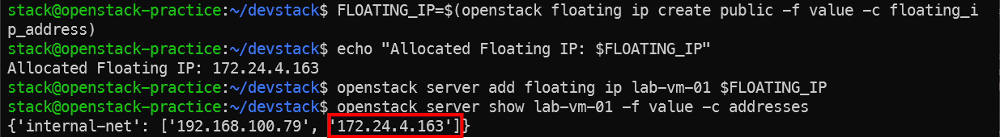

```bash
# DevStack VM 내부에서 직접 접속 테스트
# CirrOS 기본 계정: cirros / gocubsgo
ping -c 3 $FLOATING_IP
ssh -i ~/.ssh/id_rsa_lab cirros@$FLOATING_IP
```

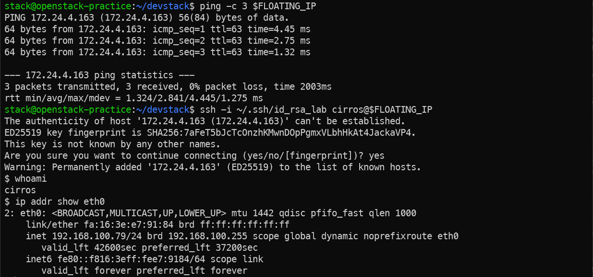

```bash
# 외부 PC(학생 노트북 등)에서 접속 시 SSH 터널 사용
# [DevStack_VM_IP]는 OpenStack이 설치된 VM의 IP

# (1) 외부 PC에서 실행 - DevStack VM 경유하여 Floating IP의 22번 포트를 노트북 2222 포트로 포워딩
ssh -L 2222:[FLOATING_IP]:22 ubuntu@[DevStack_VM_IP]

# (2) 다른 터미널에서 실행 - 터널을 통해 CirrOS 접속 (1번 터미널을 종료하면 연결 끊김)
ssh -p 2222 cirros@localhost
# password : gocubsgo
```

```bash
# 두 번째 VM 생성 후 동일 Floating IP를 이동
openstack server create lab-vm-02 \
  --flavor lab.small \
  --image cirros-0.6.3-x86_64-disk \
  --network $NET_ID \
  --key-name lab-keypair \
  --security-group lab-secgroup

# 기존 VM에서 Floating IP 해제
openstack server remove floating ip lab-vm-01 $FLOATING_IP

# 새 VM으로 Floating IP 매핑
openstack server add floating ip lab-vm-02 $FLOATING_IP

# 매핑 확인
openstack server show lab-vm-02 -f value -c addresses

# 이후 이 Floating IP로 lab-vm-02에 접속 가능
```

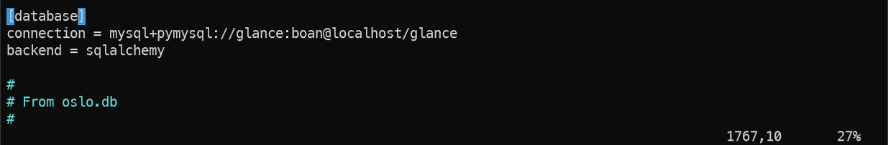

### 참고
- 보안 그룹은 VM의 vNIC 레벨에서 적용되는 stateful 방화벽
  - 기본 정책 : 모든 인바운드 차단, 모든 아웃바운드 허용
  - `Allow Rule`만 추가 가능 (`Deny Rule`은 지원하지 않음)
- 웹 서버 표준 규칙 : TCP 22 (SSH), TCP 80 (HTTP), TCP 443 (HTTPS)
- Floating IP는 서비스 중단 없이 다른 VM으로 동적 이동 가능
- Floating IP에 호스트와 동일한 네트워크 대역을 할당하면 외부에서 직접 접근 가능하나, 실제 IP 자원을 차지하므로 본 실습에서는 격리된 가상 대역(`172.24.4.0/24`)을 사용
- Floating IP 대역(`172.24.4.0/24`)은 DevStack VM 내부에서만 통하므로, 외부에서 접속하려면 SSH 포트 포워딩(`ssh -L`) 사용
- 위 패턴은 실무에서 Bastion Host(점프 서버)를 통해 사설 클라우드 VM에 접속하는 방식과 동일
- **왜 사설 IP + Floating IP 구조를 쓰는가**  
  VM에게 회사 네트워크 IP를 직접 부여하는 방식(`provider network`)도 기술적으로 가능하지만, 일반적으로 다음 이점 때문에 사설 IP + Floating IP 구조를 사용
  - **IP 자원 절약** : 외부 노출이 필요한 VM에만 공인 IP 할당, 나머지는 사설 대역 자유롭게 사용
  - **보안 격리** : 외부 네트워크와 VM 사이를 NAT로 분리, 명시적으로 노출한 포트 외에는 접근 차단
  - **멀티 테넌트** : 프로젝트 A와 B가 동일한 사설 대역(`192.168.10.0/24`)을 충돌 없이 사용 가능
  - **VM 이동성** : VM을 다른 호스트로 마이그레이션해도 사설 IP 그대로 유지, Floating IP는 외부 사용자 모르게 다른 VM으로 이동 가능
  - **동적 노출 제어** : VM은 그대로 둔 채 `add floating ip` / `remove floating ip` 명령으로 외부 노출만 토글

---

## 18. Cinder - 블록 스토리지

`Cinder`는 VM 인스턴스에 영구적인 블록 스토리지(볼륨)를 제공. 인스턴스가 삭제되어도 볼륨 데이터는 보존됨

### 18-1. 볼륨 생성 및 연결

```bash
source openrc demo demo

# 1GB 볼륨 생성
openstack volume create --size 1 lab-volume-01

# available 상태로 전환 확인
openstack volume list
```

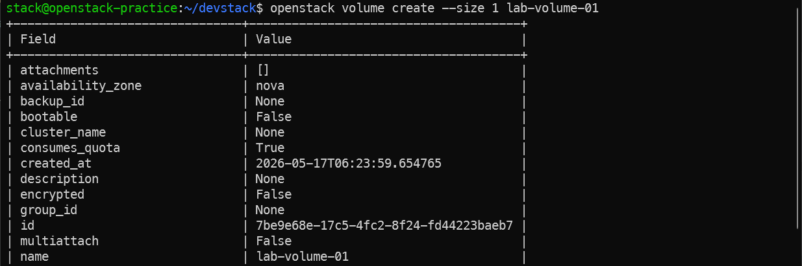
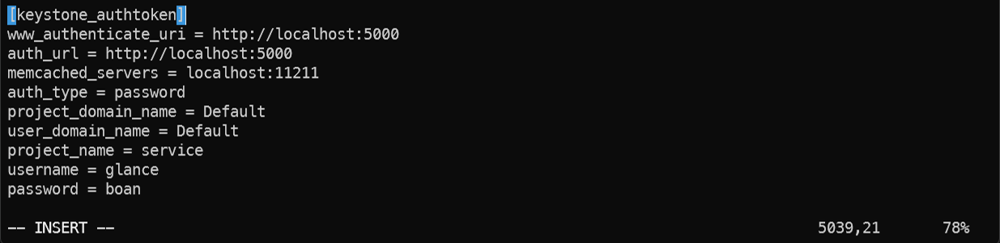

```bash
# 실행 중인 VM에 볼륨 연결 (Attach)
openstack server add volume lab-vm-01 lab-volume-01

# VM 내부에서 새 디바이스 인식 확인
# FLOATING_IP를 다시 lab-vm-01에 매핑한 후 접속
ssh -i ~/.ssh/id_rsa_lab cirros@$FLOATING_IP "lsblk"
```

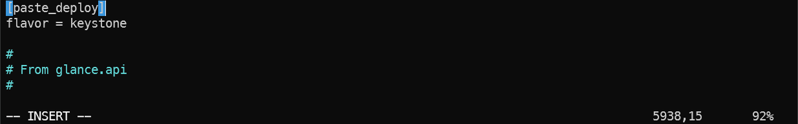
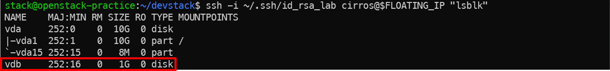

### 18-2. 볼륨 사용 테스트

```bash
# VM 내부에서 파일시스템 생성 및 마운트
ssh -i ~/.ssh/id_rsa_lab cirros@$FLOATING_IP <<'EOF'
sudo mkfs.ext4 /dev/vdb
sudo mkdir /mnt/cinder
sudo mount /dev/vdb /mnt/cinder
echo "Cinder persistent storage test" | sudo tee /mnt/cinder/test.txt
sudo umount /mnt/cinder
EOF
```

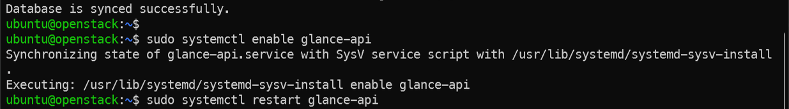

```bash
# 볼륨 분리
openstack server remove volume lab-vm-01 lab-volume-01

# 다시 연결
openstack server add volume lab-vm-01 lab-volume-01

# VM에서 다시 마운트하고 파일 확인
ssh -i ~/.ssh/id_rsa_lab cirros@$FLOATING_IP <<'EOF'
sudo mount /dev/vdb /mnt/cinder
sudo cat /mnt/cinder/test.txt
sudo umount /mnt/cinder
EOF
```

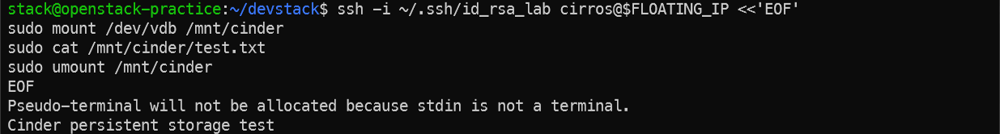

### 18-3. 스냅샷 및 복제

```bash
# 스냅샷 생성(사용중인 볼륨이므로 --force 옵션 필요)
openstack volume snapshot create --volume lab-volume-01 --force lab-snap-01
openstack volume snapshot list

# 스냅샷으로부터 새 볼륨 복제(lab-volume-02 생성)
openstack volume create --snapshot lab-snap-01 --size 1 lab-volume-02
```

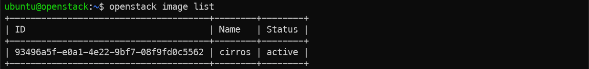
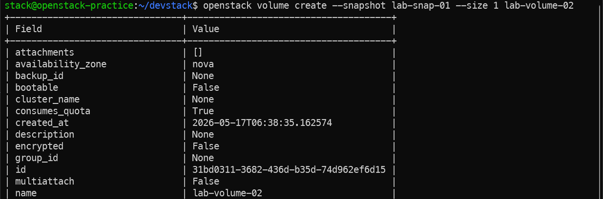

```bash
# 새로 만든 lab-volume-02를 VM에 붙여서 확인 가능
openstack server add volume lab-vm-01 lab-volume-02

ssh -i ~/.ssh/id_rsa_lab cirros@$FLOATING_IP <<'EOF'
sudo mount /dev/vdb /mnt
ls /mnt
sudo cat /mnt/test.txt
sudo umount /mnt
EOF
```

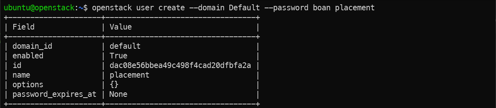

### 18-4. 볼륨 동적 확장

```bash
# 확장 전 볼륨을 VM에서 분리
openstack server remove volume lab-vm-01 lab-volume-01

# 1GB → 2GB로 확장
openstack volume set --size 2 lab-volume-01

# 다시 연결
openstack server add volume lab-vm-01 lab-volume-01
```

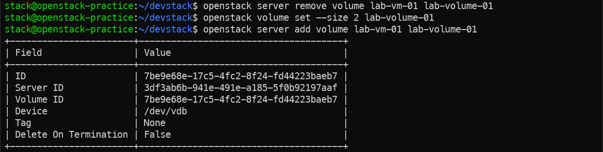

```bash
# VM 내부에서 확장된 볼륨 인식 및 파일시스템 크기 조정
ssh -i ~/.ssh/id_rsa_lab cirros@$FLOATING_IP <<'EOF'
sudo mount /dev/vdb /mnt/cinder
sudo resize2fs /dev/vdb
df -h /mnt/cinder
sudo umount /mnt/cinder
EOF
```

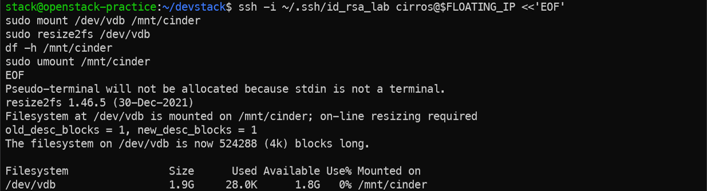

### 참고
- DevStack의 기본 Cinder 백엔드는 `LVM`이며, 운영 환경에서는 Ceph RBD / NetApp 등으로 교체
- VM 삭제와 무관하게 데이터가 보존되므로 DB, 파일시스템 등 `Stateful` 워크로드에 적합
- 볼륨 백업(`openstack volume backup create`)은 Swift 등 외부 오브젝트 스토리지에 저장
- Multi-attach 활성화 시 동일 볼륨을 여러 VM에 동시 연결 가능 (클러스터 파일시스템 필수)

---

## 19. Swift - 오브젝트 스토리지

`Swift`는 페타바이트 규모의 비정형 데이터를 저장하는 오브젝트 스토리지 서비스
계층 구조 : `Account` → `Container` → `Object`

```bash
cd /opt/stack/devstack
source openrc demo demo

# Swift 서비스 동작 확인
openstack object store account show
```

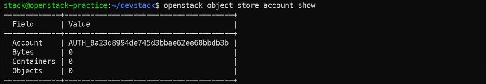

```bash
# 컨테이너 생성 (폴더 개념)
openstack container create lab-data

# 컨테이너 목록 확인
openstack container list
```

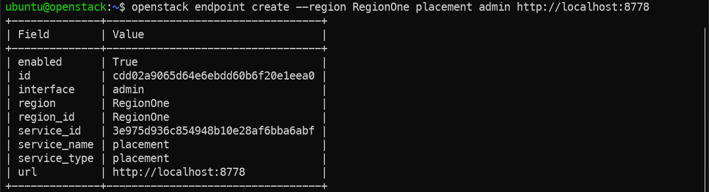

```bash
# 오브젝트(파일) 업로드
echo "Storage Virtualization test data" > dataset.txt
openstack object create lab-data dataset.txt

# 오브젝트 목록 및 메타데이터 확인
openstack object list lab-data
openstack object show lab-data dataset.txt
```

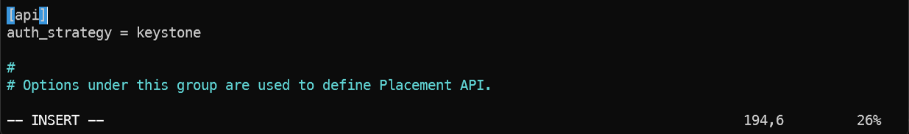

```bash
# 오브젝트 다운로드
openstack object save lab-data dataset.txt --file /tmp/dataset-downloaded.txt
cat /tmp/dataset-downloaded.txt
```

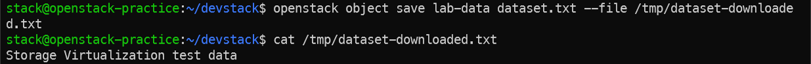


```bash
# 컨테이너 내 모든 오브젝트 삭제
openstack object delete lab-data dataset.txt

# 빈 컨테이너 확인
openstack object list lab-data

# 컨테이너 삭제 (비어있어야 삭제 가능)
openstack container delete lab-data

# 삭제 확인
openstack container list
```

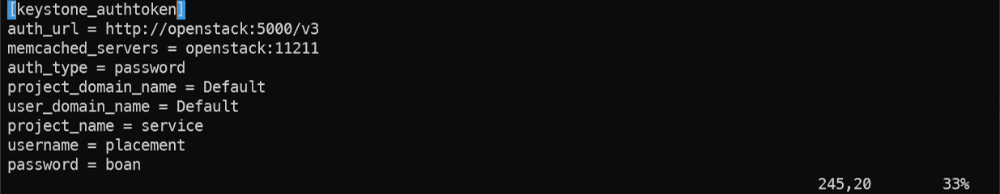

### 참고
- Swift는 REST API 기반이므로 `curl`로 직접 접근 가능 (`X-Auth-Token` 헤더에 토큰 전달)
- 운영 환경 특성
  - **3벌 복제** (replicas=3) : 단일 노드 환경에서는 `SWIFT_REPLICAS=1`로 축소
  - **자가 치유** (auditor/replicator) : 손상된 오브젝트 자동 복구
  - **리밸런싱** : 노드 추가/제거 시 데이터 분포 자동 재조정
- 컨테이너는 비어있어야 삭제 가능. 내부에 오브젝트가 남아있으면 `Conflict` 에러 발생
- `openstack container delete --recursive lab-data` 옵션으로 안의 오브젝트까지 한 번에 삭제 가능 (위험하므로 운영 환경에서 주의)

---

## 20. Heat - 오케스트레이션 (IaC)

`Heat`는 텍스트 템플릿(HOT)을 사용하여 복합 자원을 스택(Stack) 단위로 일괄 생성/관리하는 서비스

### 20-1. HOT 템플릿 작성

```bash
cd /opt/stack/devstack
source openrc demo demo

# Heat 템플릿 파일 작성
cat > /tmp/lab-stack.yaml <<'EOF'
heat_template_version: 2021-04-16
description: Simple lab stack - VM with network and volume

parameters:
  image_name:
    type: string
    default: cirros-0.6.3-x86_64-disk
  flavor_name:
    type: string
    default: lab.small
  network_name:
    type: string
    default: internal-net
  keypair_name:
    type: string
    default: lab-keypair

resources:
  lab_volume:
    type: OS::Cinder::Volume
    properties:
      size: 1
      name: heat-managed-volume

  lab_instance:
    type: OS::Nova::Server
    properties:
      name: heat-managed-vm
      image: { get_param: image_name }
      flavor: { get_param: flavor_name }
      key_name: { get_param: keypair_name }
      networks:
        - network: { get_param: network_name }

  lab_attachment:
    type: OS::Cinder::VolumeAttachment
    properties:
      volume_id: { get_resource: lab_volume }
      instance_uuid: { get_resource: lab_instance }

outputs:
  instance_ip:
    description: VM의 사설 IP 주소
    value: { get_attr: [lab_instance, first_address] }
EOF
```

### 20-2. 스택 생성 및 확인

```bash
# 스택 생성
openstack stack create -t /tmp/lab-stack.yaml lab-stack

# 스택 상태 추적
openstack stack list
openstack stack show lab-stack
```

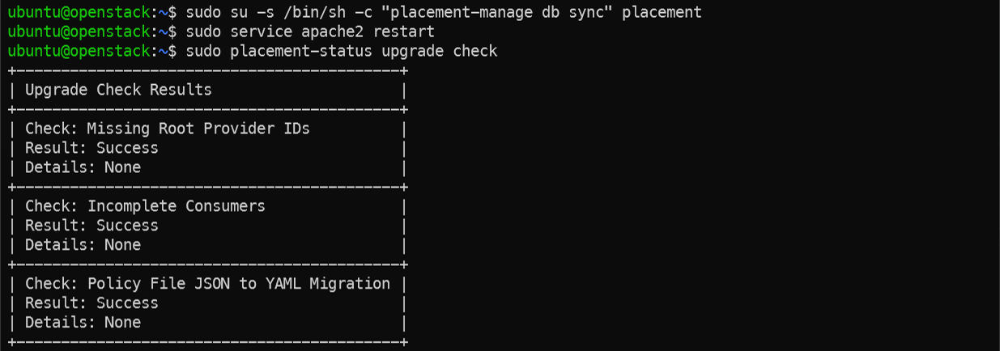
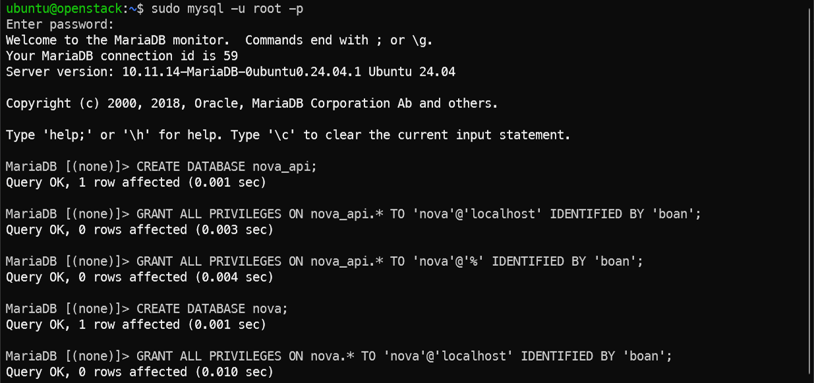

```bash
# 스택이 생성한 리소스 목록
openstack stack resource list lab-stack

# 출력값 조회
openstack stack output show lab-stack instance_ip
```

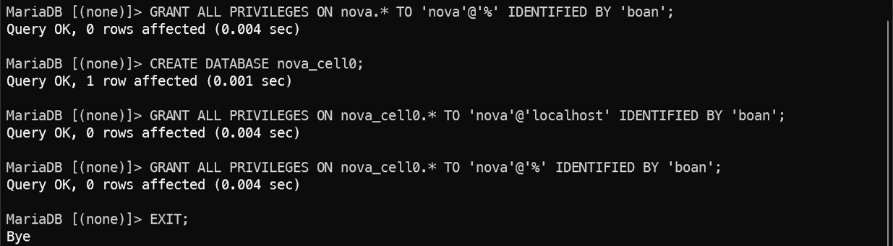

### 20-3. 스택 업데이트 및 삭제

```bash
# 스택 업데이트 (변경분만 반영)
openstack stack update -t /tmp/lab-stack.yaml lab-stack \
  --parameter flavor_name=lab.small
```

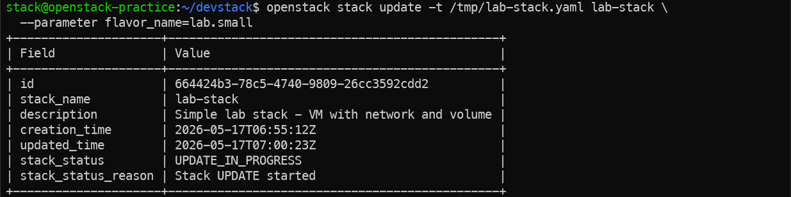

### 참고
- HOT 핵심 섹션
  - `heat_template_version` : 템플릿 문법 버전
  - `parameters` : 사용자 입력 변수
  - `resources` : 생성할 자원 정의
  - `outputs` : 생성 후 반환할 값
- 주요 리소스 타입
  - `OS::Nova::Server` : VM 인스턴스
  - `OS::Cinder::Volume` : 블록 볼륨
  - `OS::Neutron::Net` / `Subnet` / `Router` : 가상 네트워크
  - `OS::Heat::AutoScalingGroup` : 자동 확장 그룹
- AutoScaling 구성은 `Heat` + `Aodh`(알람) + `Ceilometer`(메트릭) 조합 필요

---

## 21. 웹 대시보드 - Horizon / Skyline

OpenStack은 두 가지 공식 웹 대시보드 제공
- `Horizon` : Django 기반의 전통적인 서버 사이드 렌더링 UI
- `Skyline` : Vue.js + FastAPI 기반의 SPA(Single Page Application) 구조 차세대 UI

두 대시보드 동시 활성화 시 Skyline 플러그인이 자동으로 URI를 분리하여 충돌 없이 함께 동작

| 대시보드 | 접속 URL |
|----------|----------|
| Skyline | `http://[VM_IP]:9999` |
| Horizon | `http://[VM_IP]/dashboard`(설치 방법에 따라 horizon일 수 있음) |

### 21-1. Horizon 접속

웹 브라우저에서 `http://[VM_IP]/dashboard` 접속

| 계정 | 비밀번호 |
|------|----------|
| `admin` | `ADMIN_PASSWORD` (예: `secret`) |
| `demo` | 동일 |

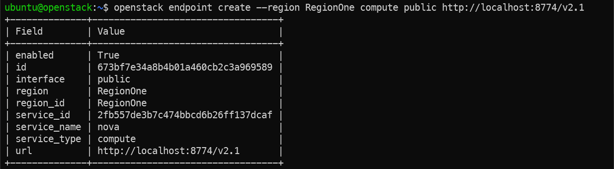

### 21-2. Skyline 접속

```bash
# Skyline 서비스 동작 확인
sudo systemctl status devstack@skyline.service

# Skyline 포트(9999) 바인딩 확인
sudo ss -tlnp | grep 9999
```

웹 브라우저에서 `http://[VM_IP]:9999` 접속 (계정은 Horizon과 동일)

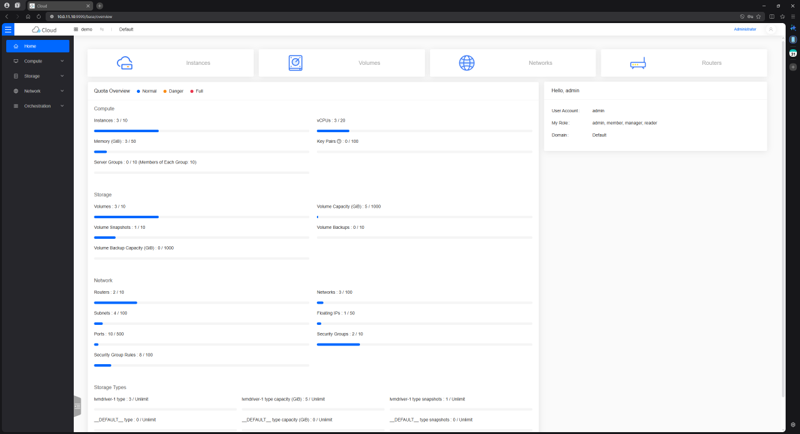

### 21-3. CLI / GUI 작업 매핑
sssssssssssss
CLI로 수행한 작업을 두 대시보드에서 동일하게 수행하며 UX 차이 비교

| 작업 | 대응 CLI |
|------|----------|
| 인스턴스 생성 | `openstack server create` |
| 이미지 목록 / 등록 | `openstack image list/create` |
| 볼륨 생성 | `openstack volume create` |
| 네트워크 토폴로지 확인 | `openstack network list` |
| 보안 그룹 설정 | `openstack security group ...` |
| 프로젝트 / 사용자 / 역할 관리 | `openstack project/user/role ...` |
| 하이퍼바이저 현황 | `openstack hypervisor list` |

### 참고
- 두 대시보드는 동일한 OpenStack REST API를 호출하므로, 어느 쪽에서 자원을 생성하든 다른 쪽에서 즉시 조회 가능
- `Horizon`은 페이지 이동 시마다 서버에서 HTML을 렌더링하여 응답 (Django 기반 SSR)
- `Skyline`은 SPA 구조로 초기 1회 로딩 후 브라우저에서 화면 전환, 백엔드(FastAPI)는 비동기로 API 중계
- Skyline의 Network Topology, 하이퍼바이저 선택 등 일부 기능은 Horizon보다 직관적으로 시각화됨

---

## 22. 토큰 기반 API 호출

OpenStack의 모든 서비스는 `X-Auth-Token` 헤더로 전달된 토큰을 Keystone에 검증한 후 API 요청 처리

```bash
# Nova API 엔드포인트 확인 (admin 권한 필요)
source openrc admin admin
NOVA_URL=$(openstack endpoint list --service compute --interface public -f value -c URL)
echo "Nova endpoint: $NOVA_URL"
```

```bash
# 1. 로그인 요청 → demo 사용자로 Fernet Token 발급
# [VM_IP]는 현재 VM의 IP 주소로 변경
TOKEN=$(curl -si -X POST http://[VM_IP]/identity/v3/auth/tokens \
  -H "Content-Type: application/json" \
  -d '{
    "auth": {
      "identity": {
        "methods": ["password"],
        "password": {
          "user": {
            "name": "demo",
            "domain": {"name": "Default"},
            "password": "secret"
          }
        }
      },
      "scope": {
        "project": {
          "name": "demo",
          "domain": {"name": "Default"}
        }
      }
    }
  }' | grep -i "^x-subject-token" | awk '{print $2}' | tr -d '\r')

echo "Issued token: ${TOKEN:0:60}..."
echo "Token length: ${#TOKEN}"
```

```bash
# 2. 발급받은 토큰으로 Nova API 직접 호출 (demo 프로젝트의 VM 목록 조회)
curl -s -H "X-Auth-Token: $TOKEN" $NOVA_URL/servers | python3 -m json.tool
```

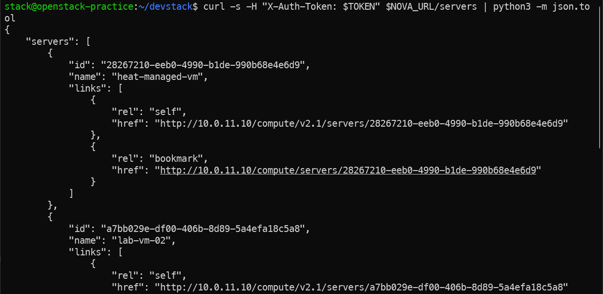

```bash
# 3. 잘못된 토큰으로 호출 시도 (검증 실패 확인)
curl -s -o /dev/null -w "HTTP %{http_code}\n" \
  -H "X-Auth-Token: invalid-token-xxx" \
  $NOVA_URL/servers
```

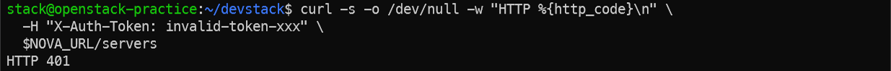

### 참고
- Keystone은 Fernet 키로 토큰을 복호화하여 (1) 만료 시각 (2) 사용자/프로젝트/역할 (3) 정책 기반 인가 결정
- 토큰 검증 결과는 `Memcached`에 캐싱되어 반복 호출 시 DB I/O 절감
- 토큰 유효기간(TTL)은 기본 1시간
- `identity:list_services`, `identity:list_endpoints` 등 서비스 카탈로그 조회는 기본 정책상 admin 권한 필요. 일반 사용자(demo)는 자신의 프로젝트 내 자원만 조회/관리 가능
- API 응답으로 받는 자원 목록은 토큰의 scope(프로젝트)에 따라 달라짐. demo 토큰으로 조회 시 §15에서 생성한 `lab-vm-01`, `lab-vm-02`가 표시되며, 같은 API 엔드포인트라도 admin 토큰으로 조회하면 다른 결과가 반환됨
- 잘못된 토큰으로 호출 시 HTTP 401(Unauthorized) 응답. 모든 OpenStack 서비스가 동일하게 Keystone 검증을 거치므로 인증 우회 불가

---

## 23. 운영 점검 및 로그 분석

```bash
# 시스템 상태 종합 확인
openstack hypervisor list
openstack compute service list
openstack network agent list
openstack volume service list
```

```bash
# 서비스 로그 확인 (systemd 기반)
sudo journalctl -u devstack@n-api.service --since "1 hour ago" | tail -20
sudo journalctl -u devstack@n-sch.service --since "1 hour ago" | tail -20
sudo journalctl -u devstack@n-cpu.service --since "1 hour ago" | tail -20
sudo journalctl -u devstack@q-svc.service --since "1 hour ago" | tail -20
sudo journalctl -u devstack@keystone.service --since "1 hour ago" | tail -20
```

| 서비스 | systemd 유닛 | 주요 로그 내용 |
|--------|--------------|----------------|
| Nova API | `devstack@n-api.service` | REST API 요청 처리 |
| Nova Scheduler | `devstack@n-sch.service` | VM 배치 결정 |
| Nova Compute | `devstack@n-cpu.service` | libvirt 호출, VM lifecycle |
| Nova Conductor | `devstack@n-cond.service` | DB 중계 작업 |
| Neutron | `devstack@q-svc.service` | 가상 네트워크 프로비저닝 |
| Keystone | `devstack@keystone.service` | 인증/인가, 토큰 발급 |
| Glance | `devstack@g-api.service` | 이미지 등록/배포 |
| Cinder | `devstack@c-api.service` | 볼륨 API |

### 참고
- 운영 체크리스트
  - **일일** : 컴퓨트 노드 상태 확인, 스토리지 용량 모니터링
  - **주간** : MariaDB 백업 확인, 만료 토큰 정리(`keystone-manage token_flush`)
  - **보안/성능** : NTP 시간 동기화, Fernet Key Rotation 수행
- 트러블슈팅 시나리오
  - `VM 생성 실패 (NoValidHost)` → `n-sch.service` 로그, Placement 인벤토리 점검
  - `이미지 다운로드 오류` → `g-api.service` 로그, Glance 백엔드 용량 확인
  - `네트워크 통신 불가` → 보안 그룹 규칙, OVN 컨트롤러 상태(`ovn-nbctl show`), 외부 게이트웨이 확인

---

## 24. 실습 자원 정리

OpenStack 자원은 의존성이 있으므로 역순으로 정리. VM → Floating IP → 볼륨/스냅샷 → 네트워크 → 사용자/도메인 순서

**하위요소가 남아있는 요소들은 삭제 시 `Conflict` 또는 `ResourceInUse` 에러 발생**

### 24-1. Heat 스택 정리

스택 단위로 한 번에 정리 가능 (Heat이 만든 모든 자원 자동 삭제)

```bash
source openrc demo demo

# Heat 스택 삭제
openstack stack delete lab-stack --yes

# 삭제 확인
openstack stack list
```

### 24-2. VM 및 Floating IP 정리

```bash
source openrc demo demo

# Floating IP 해제 후 반환
openstack server remove floating ip lab-vm-02 $FLOATING_IP
openstack floating ip delete $FLOATING_IP

# VM 삭제 (연결된 볼륨은 자동 분리됨)
openstack server delete lab-vm-01 lab-vm-02

# 삭제 확인
openstack server list
```

### 24-3. 볼륨 및 스냅샷 정리

스냅샷이 존재하는 볼륨은 삭제 불가. 스냅샷 먼저 삭제

```bash
# 스냅샷 삭제
openstack volume snapshot delete lab-snap-01

# 볼륨 삭제
openstack volume delete lab-volume-01 lab-volume-02

# 삭제 확인
openstack volume list
openstack volume snapshot list
```

### 24-4. Swift 오브젝트 및 컨테이너 정리

```bash
# 컨테이너 내 모든 오브젝트 삭제
for obj in $(openstack object list lab-data -f value -c Name); do
  openstack object delete lab-data "$obj"
done

# 빈 컨테이너 확인 후 삭제
openstack container delete lab-data

# 삭제 확인
openstack container list
```

### 24-5. 이미지 정리

```bash
source openrc admin admin

# 추가 등록한 Ubuntu 이미지 삭제
openstack image delete ubuntu-24.04

# 삭제 확인 (CirrOS 등 DevStack 기본 이미지만 남음)
openstack image list
```

### 24-6. 네트워크 정리

라우터의 외부 게이트웨이 해제 → 서브넷 인터페이스 분리 → 라우터 삭제 → 서브넷/네트워크 삭제 순서

```bash
source openrc demo demo

# 라우터 외부 게이트웨이 해제
openstack router unset --external-gateway lab-router

# 라우터에서 내부 서브넷 인터페이스 분리
openstack router remove subnet lab-router internal-subnet

# 라우터 삭제
openstack router delete lab-router

# 서브넷 및 네트워크 삭제
openstack subnet delete internal-subnet
openstack network delete internal-net

# 삭제 확인
openstack router list
openstack network list
```

### 24-7. 보안 그룹 및 키페어 정리

```bash
# 보안 그룹 삭제
openstack security group delete lab-secgroup

# 키페어 삭제
openstack keypair delete lab-keypair
```

### 24-8. Flavor 정리 (admin)

```bash
source openrc admin admin

# 실습용 Flavor 삭제
openstack flavor delete lab.small
```

### 24-9. Keystone 자원 정리 (admin)

사용자 → 프로젝트 → 도메인 순서로 정리. 도메인 삭제 시 먼저 비활성화 필요

```bash
# 사용자 삭제
openstack user delete student --domain dku

# 프로젝트 삭제
openstack project delete cloud-lab --domain dku

# 도메인 비활성화 후 삭제
openstack domain set --disable dku
openstack domain delete dku

# 삭제 확인
openstack domain list
```

### 참고
- 자원 삭제는 항상 **의존성 역순**으로 진행
  - VM이 볼륨에 연결되어 있으면 → VM 먼저 삭제
  - 스냅샷이 볼륨 참조 중이면 → 스냅샷 먼저 삭제
  - 라우터가 네트워크에 연결되어 있으면 → 라우터 인터페이스 먼저 분리
- 도메인은 **비활성화 후에만 삭제 가능**. 활성 상태의 도메인 삭제 시도 시 `Cannot delete a domain that is enabled` 에러
- 자원이 많아 일일이 삭제하기 번거로우면 `./unstack.sh` 또는 `./clean.sh`로 DevStack 환경 자체를 초기화하는 것이 빠름

---

## 25. DevStack 환경 정리

OpenStack 자원이 아닌 DevStack 자체를 초기화하는 명령어

```bash
# 실행 중인 OpenStack 서비스 중지 (DB 등 영구 데이터는 보존)
cd /opt/stack/devstack
./unstack.sh
```

```bash
# 완전 초기화 (재설치 전 모든 데이터 삭제)
./clean.sh
```

### 참고
- `unstack.sh` - 서비스만 중지. 이후 `stack.sh` 재실행 시 빠르게 복구
- `clean.sh` - DB / 설정 / 패키지 일부 잔여물 제거. 완전 재설치 시 사용
- DevStack은 시스템에 광범위한 변경을 가하므로, 가장 안전한 정리 방법은 `VM 자체 재생성`

---

## Q & A

박찬욱  
cupark@dankook.ac.kr

남재현  
namjh@dankook.ac.kr

## Networked Systems and Security Lab (BoanLab) @ DKU

